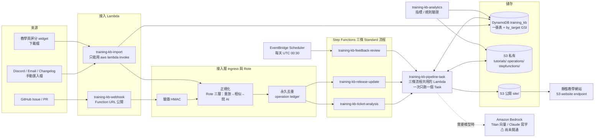
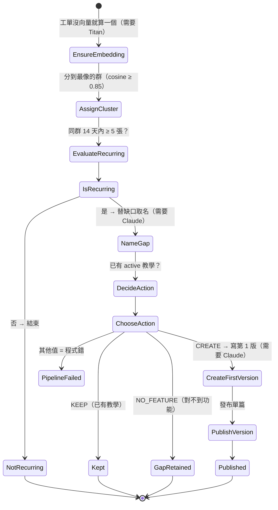
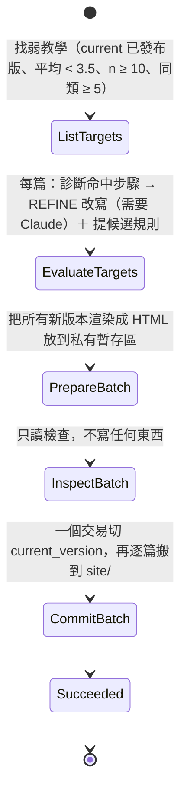
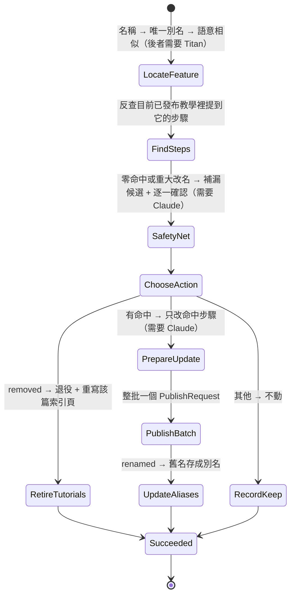
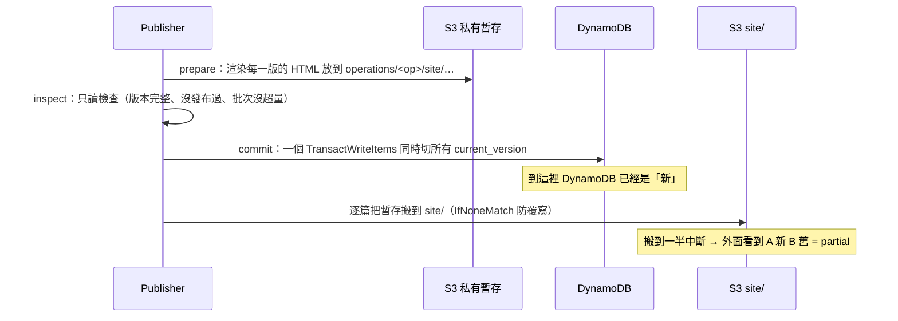

# 02 系統架構圖

> 圖是 Mermaid 格式，GitHub、VS Code（裝 Markdown Preview Mermaid 擴充）都能直接看。每張圖下面有一段白話說明。

---

## 1. 整體架構



**白話：** 事件從左邊進來，經過接入層變成乾淨的資料並去重，然後啟動對應的流程。三條流程都在同一支 Lambda 上跑（靠參數決定跑哪條的哪一步）。所有資料放一張 DynamoDB 表和一個 S3 bucket；只有 `site/` 是公開的。需要 AI 的步驟會去呼叫 Bedrock，但目前帳號沒開通，那些步驟會失敗。

---

## 2. AWS 上實際有哪些東西

| 類型 | 名稱 | 用途 |
|---|---|---|
| CloudFormation stack | `TrainingKbData` | DynamoDB 表、S3 bucket、資料存取角色、網站設定（幾乎不動） |
| CloudFormation stack | `TrainingKbApp` | 下面所有 Lambda、state machine、排程、log group、IAM（改程式就重部署它） |
| DynamoDB | `training_kb`（GSI：`by_target`） | 唯一的資料表 |
| S3 | `training-kb-content-example` | 唯一的 bucket；`site/*` 公開讀、其餘私有 |
| S3 website | `http://<bucket>.s3-website-us-east-1.amazonaws.com` | 公開教學網站（只有 HTTP） |
| Lambda | `training-kb-webhook` | GitHub webhook 入口；**唯一有 Function URL 的**；驗簽在程式裡做 |
| Lambda | `training-kb-import` | 手動匯入（回饋、瀏覽、工單、改版）；沒有 URL，只能 `aws lambda invoke` |
| Lambda | `training-kb-pipeline-task` | 三條流程共用；state machine 每一步呼叫它一次 |
| Lambda | `training-kb-analytics` | 算指標（`action: metrics`）、驗證規則（`action: validate_rules`） |
| Lambda layer | `training-kb-deps` | `pydantic`、`jsonschema`（Lambda 執行環境沒有的套件） |
| Step Functions | `training-kb-ticket-analysis` | 工單分析流程 |
| Step Functions | `training-kb-release-update` | 改版更新流程 |
| Step Functions | `training-kb-feedback-review` | 回饋檢視流程 |
| EventBridge Scheduler | `training-kb-feedback-review-daily` | `cron(30 0 * * ? *)` UTC，input `{"mode":"formal"}` |
| CloudWatch Logs | `/aws/vendedlogs/states/training-kb-*` | 三條流程的執行 log（保留 90 天） |

全部固定在 **`us-east-1`**，帳號 **`123456789012`**。

---

## 3. 三條流程的步驟

### 3.1 ticket-analysis（工單分析）



目前在真實 AWS 能跑到終點的是 `NotRecurring`（工單已有向量、同群不到 5 張）。其他路徑因為需要模型，停在 `NameGap` 或 `EnsureEmbedding` 的 `PermanentError`。

### 3.2 feedback-review（回饋檢視）



零弱教學時整條流程 0 次呼叫模型，在真實 AWS 已跑到 `Succeeded`。有目標時停在 `EvaluateTargets`（O5）。

### 3.3 release-update（改版更新）



`RetireTutorials` 路徑不需要模型，在真實 AWS 已跑到 `Succeeded`，退役提示與後繼連結能從公開網站讀到。

### 3.4 每一步的失敗語意（三條流程共用）

```
Task 丟 TransientError ──▶ 等 1 秒重試 ──▶ 等 2 秒重試 ──▶ 還是失敗 ──▶ PipelineFailed
Task 丟 PermanentError / PublishError / 其他 ──────────────────────────▶ PipelineFailed（不重試）
```

- Retry 只認例外的**類別名字串**（`TransientError`），所以程式不能丟子類。
- 失敗事件在 execution history 裡的欄位叫 `lambdaFunctionFailedEventDetails`。
- 走到 `PipelineFailed` 不會發布任何東西、不會切 `current_version`。

---

## 4. 資料怎麼放：一張表放十種東西

DynamoDB 只有一張表，每筆資料靠 `PK`（主鍵）的前綴分辨是哪種東西，`SK`（排序鍵）分辨是「本體」還是「關係」：

```
PK                              SK                         這是什麼
TUTORIAL#prepare-meeting        META                       一篇教學的本體（含 current_version、status）
VERSION#prepare-meeting@v2      META                       某一版（published_at、supersedes、reason）
STEP#prepare-meeting@v2#3       META                       該版第 3 步（type、text）
STEP#prepare-meeting@v2#3       REFERS_TO#FEATURE#Export   關係邊：這一步提到 Export 功能
FEATURE#Export                  META                       一個產品功能（name、aliases）
TICKET#t_1001                   META                       一張工單（cluster_id、embedding）
RELEASE#r_42                    META                       一筆改版
FEEDBACK#f_site-…               META                       一則評分留言
FEEDBACK#f_site-…               REFERS_TO#VERSION#…@v1     關係邊：這則回饋屬於哪一版
VIEW#…                          META                       一次瀏覽紀錄
RULE#R-007                      META                       一條寫作規則（status: candidate/active/retired）
PROC#<16 字元簽名>               META                       Rote 記住的處理程序
OPS#op-ticket-t_1001            META                       operation 紀錄（status、execution_arn）
```

- 反向查詢（例如「哪些步驟提到 Export？」）走 `by_target` GSI，查到候選後**一定回基表再核對一次**（GSI 可能落後）。
- 所有讀寫都經過 `repository.py`；程式其他地方看不到 `PK`／`SK`。

---

## 5. S3 裡的東西

```
bucket/
├── site/                         ← 唯一公開的前綴（bucket policy 只開這裡）
│   ├── index.html                   所有教學的索引
│   ├── assets/{style.css, widget.js}
│   └── tutorials/<slug>/
│       ├── index.html               該篇的版本索引；退役時顯示提示與後繼
│       ├── v1.html, v2.html …       已發布版本頁（發布後不可覆寫）
│       └── v2.diff.txt              與前一版的差異
├── tutorials/<slug>/v2.md, v2.diff  私有：教學原文與差異
├── operations/<operation_id>/       私有：每次處理的輸入、模型輸出、暫存的 HTML、結果
├── stepfunctions/<pipeline>/v1.json 私有：部署時的流程定義快照（與 infra/ 的檔案逐 byte 相同）
└── operations/rules/…               私有：規則驗證證據
```

---

## 6. 發布為什麼是最難的一段（已知限制）



DynamoDB 和 S3 沒辦法在同一個交易裡完成，所以「搬到一半」這個窗口存在。系統做了兩件事來面對它：（1）`pending-promote.json` 記下待搬清單，`resume_publish` 可以把剩下的補完；（2）測試與報告裡老實記錄這個限制（代號 O3）。Demo 不會碰到（一次只發布一篇），不用處理。

---

## 7. 本機開發時的替身

| 真的東西 | 本機測試用什麼代替 |
|---|---|
| DynamoDB／S3 | `moto`（純本機模擬）；`tests/integration/conftest.py` 提供 `table`／`bucket`／`repository` fixture |
| Bedrock | `RecordingWriter`（假的 writer，記錄呼叫、回固定答案）；`tests/unit/conftest.py` |
| Step Functions | `run_sequence`（在本機一次跑完整條流程）；雲端則是每一步各呼叫一次 Lambda |
| 真實 AWS | 標 `@pytest.mark.aws` 的測試，設 `TKB_RUN_AWS_INTEGRATION=1` 才跑 |
