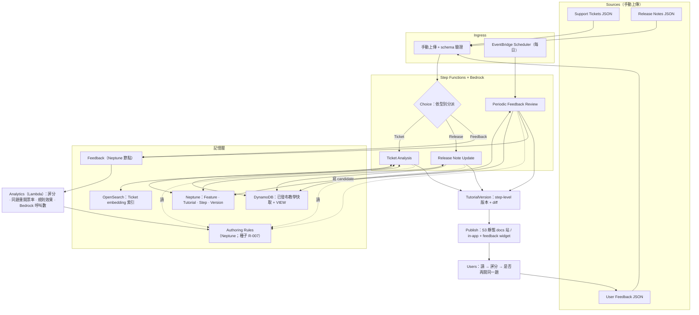
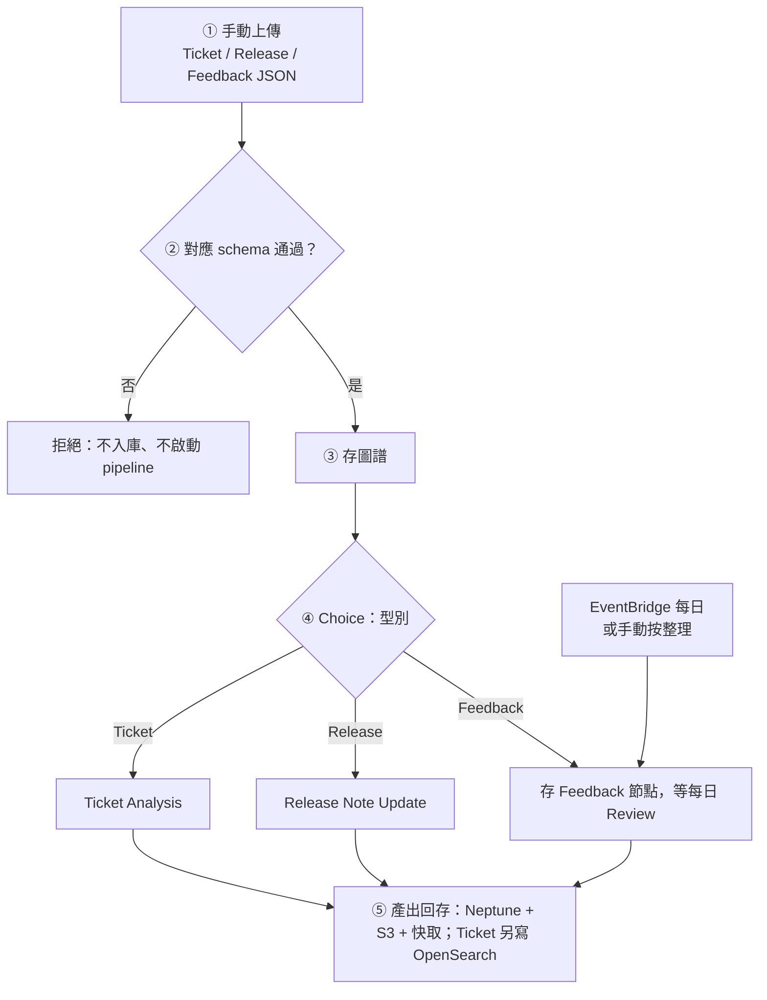
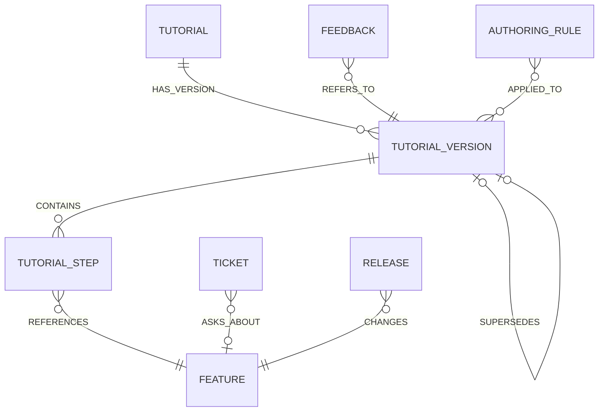
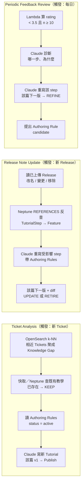
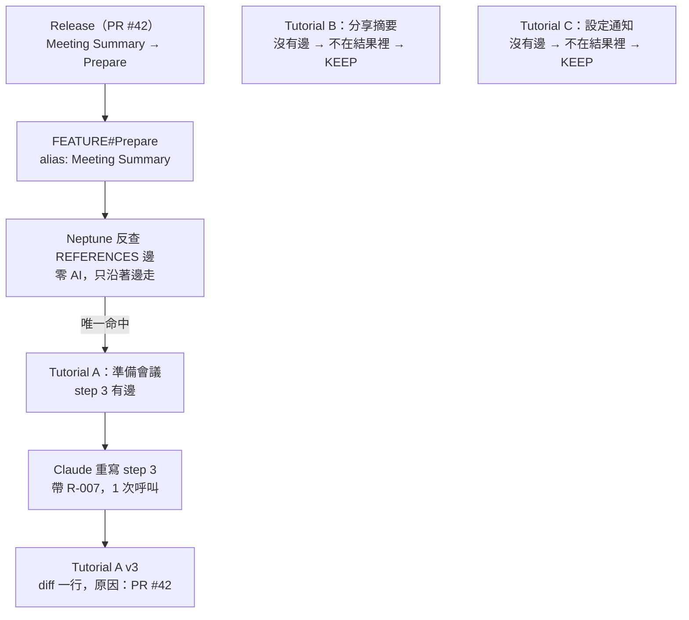
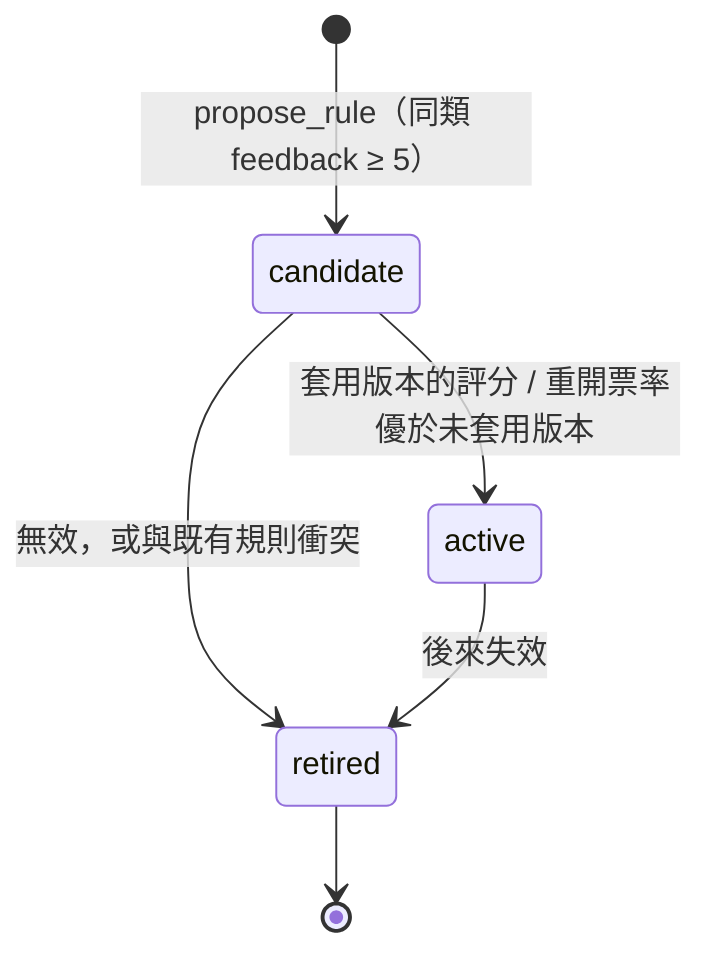

# 自我優化 Training Knowledge Base — 設計文件

| 項目 | 內容 |
|---|---|
| 版本 | v1.2（記憶層改 Neptune 權威 + OpenSearch 衍生 + DynamoDB 快取） |
| 日期 | 2026-09-13 |
| 狀態 | Draft — 供團隊實作與評審說明 |
| 目標平台 | AWS serverless 運算 + Neptune／OpenSearch（用完即刪） |
| 定位 | Indie / solo builder 的自我優化教學系統；企業 Copilot 版為後續可選路線 |

---

## 目錄

1. [摘要](#1-摘要)
2. [問題與定位](#2-問題與定位)
3. [目標、非目標與範圍護欄](#3-目標非目標與範圍護欄)
4. [名詞定義](#4-名詞定義)
5. [系統架構（AWS）](#5-系統架構aws)
6. [資料流：一則事件的旅程](#6-資料流一則事件的旅程)
7. [接入層設計：手動上傳與 schema](#7-接入層設計手動上傳與-schema)
8. [記憶層設計：Neptune + OpenSearch + DynamoDB 快取 + S3](#8-記憶層設計neptune--opensearch--dynamodb-快取--s3)
9. [三條 pipeline 規格](#9-三條-pipeline-規格)
10. [三個挑選與圖譜反查](#10-三個挑選與圖譜反查)
11. [Authoring Rules 設計](#11-authoring-rules-設計)
12. [Self-learning 的定義與兩種學習](#12-self-learning-的定義與兩種學習)
13. [比對策略：硬比對、語意比對、AI 判斷](#13-比對策略硬比對語意比對ai-判斷)
14. [Agent 與 tool 設計](#14-agent-與-tool-設計)
15. [指標與分析](#15-指標與分析)
16. [Demo 腳本](#16-demo-腳本)
17. [安全、成本與關閉清單](#17-安全成本與關閉清單)
18. [風險與緩解](#18-風險與緩解)
19. [未來方向](#19-未來方向)
20. [附錄](#20-附錄)

---

## 1. 摘要

這個系統替「有作品上線但沒有人力寫教學」的 builder，持續產生、更新、優化使用者教學（Tutorial），並且用真實的使用結果衡量教學有沒有教會人。它從三種訊號學習：

| 訊號 | 系統從中學到 | 對應動作 |
|---|---|---|
| Support Tickets | 使用者想學什麼 | CREATE / KEEP |
| Release Notes（產品改版） | 哪些教學過期了 | UPDATE / RETIRE |
| User Feedback（評分、留言、是否再開同一題） | 哪些教學沒有教會人 | REFINE + 提出 Authoring Rule |

與市面上「會自動更新的知識庫」不同的三個點：

1. **量學習成效**：不只看評分（Kirkpatrick Level 1），還看「看過教學後有沒有再開同一題」（接近 Level 3）。
2. **可轉移的教學規則**：Tutorial A 的失敗會被歸納成帶證據、有範圍、可下架的 Authoring Rule，讓從未被抱怨過的 Tutorial B 第一版就寫得對。
3. **Step-level 的精準更新**：產品改版時沿圖譜的邊找到受影響的那一步，只改那一步，其他教學完全不被觸碰。

一句話：

> Indie builders ship faster than they can teach. We keep the teaching current, and we learn from every user who got stuck.

運算層用 Lambda、Step Functions、S3、EventBridge（always-free 額度內）。記憶層是 **Neptune（權威圖譜）+ OpenSearch（衍生語意索引）+ DynamoDB（已發布教學快取與瀏覽事件）+ S3（正文）**。Bedrock 用新帳號 credits。Neptune／OpenSearch 錄完 demo 當場刪除。

---

## 2. 問題與定位

### 2.1 問題

AI 讓大量個人與小團隊把作品上線，但幾乎沒有人寫使用者教學；即使寫了，每一次 commit 都讓教學過期一點。這些 builder 沒有 IT enablement 團隊，沒有人回答重複的問題、沒有人追產品變更、沒有人讀 feedback。

企業版的同一個問題：IT Enablement 團隊不斷替重複出現的問題建立教學，產品更新時人工維護文件，定期人工閱讀 feedback 判斷哪些教學該改。

### 2.2 定位：三個問題

系統只回答三件事：

1. **該教什麼？** Support Tickets 告訴你。
2. **教學有效嗎？** Feedback 與重複開票告訴你。
3. **教學還正確嗎？** Release Notes 告訴你。

### 2.3 市場對照（查證日期 2026-09-12）

| 類別 | 既有產品 | 它們做到的 | 它們沒做的 |
|---|---|---|---|
| 自動更新的知識庫 | Loma（plotlinelabs）、Onyx agent-wiki | 從 tickets / PR / Slack 更新 agent 的 skills；git 管理的 wiki 由 agent 回寫 | 學習對象是 agent 或文件，不是人；沒有「人有沒有學會」的維度 |
| 從工單找知識缺口並生成文章 | Intercom Fin Suggestions、Helply Gap Finder、Macha（Zendesk） | Ticket → 缺口 → 自動生成文章 | 沒有教學成效量測、沒有跨文章的教訓轉移 |
| Digital Adoption Platform | Whatfix、WalkMe | 偵測 UI 變更更新 flow、分析使用者流失點 | 需在應用程式上疊 overlay，企業採購週期長；流程內容仍由人寫；沒有跨 flow 的規則學習 |
| 從 PR 更新開發文件 | Mintlify Autopilot、coding agents | 合併 PR 後建議或自動產生文件更新 | Autopilot 只開給 Custom plan；沒有讀者成效回饋 |
| 官方 Copilot 教學 | Copilot Academy、Learning Agent（Microsoft） | 通用 Copilot 教學，官方自己更新 | 看不到單一組織的 tickets 與 feedback |

結論：「Ticket → 生成文章」和「改版 → 更新文件」兩條 loop 都已是市場標配，**不是差異化**；差異化在「量成效 + 規則轉移 + step-level 精準更新」這三件事的組合。Demo 以手動上傳的 Ticket／Release／Feedback 檔為接入對象。

### 2.4 為什麼選 indie 而不是企業 Copilot

| 面向 | 企業 Copilot 版 | Indie 版 |
|---|---|---|
| Release 來源 | Microsoft 365 Message Center / Roadmap / release notes（結構化，但需租戶管理員授權） | 手動上傳已解析的 Release JSON（內容可來自 PR diff／CHANGELOG） |
| Ticket 來源 | Zendesk / ServiceNow（需企業整合） | 手動上傳 Ticket JSON |
| 主要對手 | Copilot Academy、Learning Agent、Copilot Analytics | Mintlify Autopilot、coding agents |
| Demo 可行性 | 需要真實租戶 | 上傳一批檔就能整理出教學 |
| 資料量 | 充足 | Demo 種子預放 R-007；不做跨專案規則庫 |

Hackathon 採 indie 版；企業版保留為「誰會付錢」的路線圖。兩者只差上傳檔的來源說明，核心不變。

---

## 3. 目標、非目標與範圍護欄

### 3.1 目標

- G1：從一批 tickets 自動發現 Knowledge Gap 並產生 Tutorial v1。
- G2：從累積的 feedback 找出弱的 step，產生下一版，並歸納出一條 Authoring Rule。
- G3：Authoring Rule 套用到後續新的 Tutorial 第一版，並能用成效驗證與下架。
- G4：一則 Release 進來，只重寫受影響的 TutorialStep，產生 diff。
- G5：上傳檔通過對應 schema 才入庫；否則拒絕，不寫半套物件。
- G6：運算用 always-free 服務；Neptune／OpenSearch 走試用或 credits，demo 結束當場刪除。

### 3.2 非目標（草稿 §15 護欄，維持不變）

不做：完整 LMS、影片生成、Teams 整合、真正的企業 authentication、複雜 dashboard、多種 persona、Microsoft Graph 完整整合、模型 fine-tuning、multi-agent 協作、瀏覽器合成使用者（列為未來方向）。

Demo 另不做：公開 webhook、Rote 程序性記憶、多來源 adapter、safety_net／漏邊 backfill、現場規則驗證引擎、跨專案規則平台。

### 3.3 只做兩條 loop

```
Loop 1  Ticket → Tutorial → Feedback → Refine + Rule → 下一篇 Tutorial 更好
Loop 2  Release → 受影響 step → 只改那一步 → diff
```

兩條 loop 穩定可 demo，核心故事就成立。

---

## 4. 名詞定義

| 名詞 | 定義 | 注意 |
|---|---|---|
| Ticket | 正規化後的使用者問題（手動上傳 JSON） | 對應草稿 UserProblem |
| Release | 正規化後的**產品改版事件**（手動上傳 JSON） | 不要翻成「發布」，避免與 Publish 混淆 |
| Publish | 把某個 TutorialVersion 上架的動作 | 輸出端 |
| Feedback | 使用者對某個 TutorialVersion 的 rating、category、留言 | 自帶 tutorial_version |
| Knowledge Gap | 一群語意相近、重複出現、且沒有現成教學的 Tickets | 由向量分群 + Agent 命名 |
| Feature | 產品功能節點，有 alias（改名前後的名稱都指向同一節點） | 圖譜的樞紐 |
| Tutorial | 一篇教學的身分，指向目前版本 | |
| TutorialVersion | 教學的一個版本，v1 → v2 → v3，`supersedes` 前一版，記錄改動原因 | 版本號屬於 Tutorial，不屬於 pipeline |
| TutorialStep | 版本裡的一步，帶 `references → Feature` 邊 | 精準更新的單位 |
| Authoring Rule | 從 feedback 歸納出的寫作規則，帶 evidence、applies_when、status | Demo 種子預放 R-007 |
| 五種動作 | CREATE / UPDATE / REFINE / KEEP / RETIRE | 草稿 §5 |

### 4.1 兩種「步驟」不要混用

| 名稱 | 是什麼 | 誰決定 | 會不會變 |
|---|---|---|---|
| Pipeline 節點 | 三條 Step Functions 裡的每一格 | 設計時寫死 | 不變 |
| TutorialStep | 教學內容裡的第 1、2、3 步 | 模型寫、模型改 | 有版本 |

### 4.2 三種記憶投影各管一件事

| 記憶 | 內容 | 存在哪 |
|---|---|---|
| 圖譜 | 實體與關係（誰引用哪個 Feature、哪版取代哪版、規則套用哪版） | **Neptune，權威來源** |
| 語意索引 | Ticket 像不像既有工單（分群） | **OpenSearch，可從 Neptune 重建** |
| 快取與事件 | 已發布教學成品；`TUTORIAL_VIEW` 瀏覽事件 | **DynamoDB**；正文在 **S3** |

Authoring Rule 是 Neptune 上的節點與 `APPLIED_TO` 邊，不是第三份真相。三者不互搶權威：Neptune 壞了，OpenSearch／快取可以重建；反過來不能當事實來源。

---

## 5. 系統架構（AWS）

### 5.1 元件對照

| 草稿 §11 的角色 | 原贊助商工具 | AWS 服務 | 費用 |
|---|---|---|---|
| Memory construction | Cognee | Bedrock：Claude / Nova 抽 entity 與 relation，Titan Text Embeddings V2 做語意 | credits |
| Durable memory（權威） | HydraDB | Amazon Neptune（openCypher 圖譜） | 新客戶 30 天 750 小時 `db.t3.medium`／`db.t4g.medium` 試用 |
| 語意索引（衍生） | — | OpenSearch Service（k-NN，provisioned `t3.small.search`） | 確認帳號免費層；**不用** Bedrock KB 預設的 OpenSearch Serverless Classic |
| 快取與瀏覽事件 | — | DynamoDB（cache-aside + `TUTORIAL_VIEW`） | always-free 額度內 |
| 正文 | — | S3 | always free |
| Live analytics | Hotdata | Lambda 讀 Neptune 屬性與 DynamoDB 瀏覽事件 | always free |
| Orchestration | RocketRide | Step Functions（三條 state machine）+ EventBridge Scheduler | always free |
| Security | Snyk | 維持 Snyk（免費方案）；CI 掃 dependencies、secrets | — |

### 5.2 架構圖



設計原則一句話：**流程固定、判斷開放、非法上傳拒收**。

- 流程固定：三條 pipeline 的路徑在 Step Functions 裡寫死，可預測、可重跑、出錯知道停在哪。
- 判斷開放：只有需要讀懂文字、下判斷的節點呼叫 Bedrock。
- 非法上傳拒收：三種檔各一份 schema；通過才入庫，失敗不寫半套、不呼叫 Agent。

### 5.3 Step Functions × Bedrock 在做什麼

Step Functions 是「會自己跑的流程圖」：每一步是一個任務（Lambda），前一步完成才做下一步，失敗可重試，每次執行都有紀錄。Bedrock 是「租 AI 大腦的窗口」：透過 API 呼叫 Claude、Nova、Titan 等模型，按 token 計費。

合起來：流程圖大部分格子是普通程式（算數、查表、存檔），只有幾格需要看懂人寫的文字並下判斷，那幾格才呼叫 Bedrock。像工廠輸送帶固定，只有三個站坐著師傅。

### 5.4 模型選擇

| 用途 | 模型 | 理由 |
|---|---|---|
| 判斷、寫教學、重寫 step、診斷 | Claude Haiku 級或 Nova Lite | 便宜、夠用；demo 規模幾百次呼叫 |
| 語意相似、分群 | Titan Text Embeddings V2（1,024 維，8K token） | 每千 token 約 $0.00002，比生成便宜兩個數量級 |


---

## 6. 資料流：一則事件的旅程



五段各自的責任：

| 段 | 做什麼 | 用 AI？ |
|---|---|---|
| ① | 手動上傳三種 JSON 之一（Demo UI 或受控匯入） | 否 |
| ② | 依型別跑對應 schema；失敗即拒絕 | 否 |
| ③ | 通過的物件 MERGE 進 Neptune；Ticket 另寫 OpenSearch；Feedback 只入圖 | 否 |
| ④ | Choice 依型別分派；判斷節點呼叫 Bedrock；寫教學前先讀 Authoring Rules | 判斷節點 |
| ⑤ | 新版本 → Neptune + S3；Publish 刷新 DynamoDB 快取；指標 → analytics | 否 |

Feedback 型別不立即觸發 pipeline，只寫入 Neptune Feedback 節點，由每日的 Periodic Feedback Review 一次處理——這是草稿「不能因為一個人低分就立刻修改」原則的落地。Demo 可用手動「整理」模擬排程。

不做來源簽名、Jaccard、`PROC#` 重放、或 Agent 選 adapter。

---

## 7. 接入層設計：手動上傳與 schema

### 7.1 為什麼不做接入學習

資料來源是三種已知形狀的上傳檔，不存在「下一個專案的 webhook payload 長不一樣」這個問題。Rote（簽名／Jaccard／Agent／`PROC#`）要解決的是未知來源格式；這裡用不上，整條程序性記憶不實作。

成功定義：檔案通過該型別 schema，物件以穩定 id `MERGE` 進 Neptune（Ticket 另索引 OpenSearch）。失敗定義：缺必填、枚舉不合法、或 `tutorial_version` 不存在——拒絕整筆，不寫半套、不啟動 pipeline。

### 7.2 三種檔各一份 schema

完整欄位見附錄 A。上傳時指定型別，只跑對應那一份：

| 型別 | 必填 | 通過後 |
|---|---|---|
| Ticket | `id, source, text, author, ts, project_id` | 觸發 Ticket Analysis |
| Release | `id, feature, kind, old_name, new_name`（接入時已解析完成） | 觸發 Release Note Update |
| Feedback | `id, tutorial_version, user, rating` | 只寫入，等 Periodic Feedback Review |

`source` 僅作紀錄（例如 `github_issue`、`manual`），不開啟對應 webhook 或 adapter。同一 `id` 重送只處理一次。

### 7.3 入口

MVP 只有手動上傳（Demo UI 或受控匯入）。不設 GitHub webhook、Lambda Function URL、驗簽、Discord／email 公開入口。Feedback widget 仍是已發布教學的評分出口，產出的資料以 Feedback schema 寫回，不是第二個未驗證 webhook。

種子資料用同一套 schema；Feature 引用邊在上傳或種子裡一次帶齊。

---

## 8. 記憶層設計：Neptune + OpenSearch + DynamoDB 快取 + S3

邏輯實體不變：Tutorial／Version／Step／Feature／Ticket／Release／Feedback／Authoring Rule。**不要**改成 Issue／RootCause／FAQ。不存 `PROC#`。

### 8.1 為什麼換成三層投影

查詢仍是三種關係（哪些 step 引用 Feature、一篇教學有哪些版本、規則套用過哪些版本）加上「這張工單像不像既有工單」。單表 + 暴力 cosine 功能上等價；本稿改採專門化儲存，讓反查走圖、分群走 k-NN、已發布成品走 key-value。

| 層 | 角色 | 回答什麼 | 能否重建 |
|---|---|---|---|
| Neptune | 權威來源 | 什麼跟什麼有關係 | 否（事實在這裡） |
| OpenSearch | 衍生索引 | Ticket 語意像不像 | 能：從 Neptune 的 Ticket.text 重算 embedding 再索引 |
| DynamoDB | 快取 + 事件 | 這則 Feature 有無已發布教學；誰看過哪一版 | 快取能從 Neptune 重建；`TUTORIAL_VIEW` 只寫在這裡 |
| S3 | 正文 | 該版 markdown 與 diff | 否（檔案在這裡） |

代價：Neptune 與 OpenSearch 沒有共同交易（見 §8.6），且按時間計費，demo 結束必須刪叢集。

連線：Neptune 用 **Public Endpoint + IAM 資料庫驗證**（SigV4），避免 NAT Gateway。安全群組入站限操作者 IP，不要對 `0.0.0.0/0` 長期開放。[Public endpoints](https://docs.aws.amazon.com/neptune/latest/userguide/neptune-public-endpoints.html)、[IAM auth](https://docs.aws.amazon.com/neptune/latest/userguide/iam-auth.html)。OpenSearch 用 provisioned `t3.small.search` 自建 k-NN，**不要**開 Bedrock Knowledge Bases 預設的 OpenSearch Serverless Classic（帳號第一個 collection 至少 2 OCU）。[OpenSearch pricing](https://aws.amazon.com/opensearch-service/pricing/)

### 8.2 Neptune：節點與邊

`MERGE` 的 key 必須是穩定識別碼（`t_`／`r_`／`f_`／slug／`version_id`），不能用模型生成的自然語言當 key。

| 標籤 | 穩定 id | 主要屬性 |
|---|---|---|
| `Tutorial` | `slug` | `current_version`、`topic`、`status` |
| `TutorialVersion` | `version_id`（`slug@vN`） | `reason`、`s3_key`、`published_at`、`rules_applied` |
| `TutorialStep` | `step_id`（`slug@vN#i`） | `text`、`type` |
| `Feature` | 第一次建立的功能名（改名不改 id） | `aliases[]`、`first_seen` |
| `Ticket` | `id` | `text`、`author`、`ts`、`cluster_id` |
| `Release` | `id` | `kind`、`old_name`、`new_name` |
| `Feedback` | `id` | `rating`、`category`、`comment`、`user`、`ts` |
| `AuthoringRule` | `rule_id` | `rule`、`applies_when`、`status`、`evidence`、`derived_from` |

| 邊 | 從 → 到 | 用途 |
|---|---|---|
| `HAS_VERSION` | Tutorial → TutorialVersion | 一篇有哪些版 |
| `CONTAINS` | TutorialVersion → TutorialStep | 一版有哪些步 |
| `SUPERSEDES` | TutorialVersion → TutorialVersion | 可選，指上一版 |
| `REFERENCES` | TutorialStep → Feature | 改版反查；每步恰好一條 |
| `ASKS_ABOUT` | Ticket → Feature | 0 或 1 |
| `CHANGES` | Release → Feature | 這則改版動哪個功能 |
| `REFERS_TO` | Feedback → TutorialVersion | 回饋掛在哪一版 |
| `APPLIED_TO` | AuthoringRule → TutorialVersion | 規則套用紀錄 |

### 8.2.1 實體關係圖



`TUTORIAL_VIEW` 不是圖節點：只寫 DynamoDB，欄位 `tutorial_version`、`user`、`ts`。

### 8.3 反查（取代 GSI by_target）

只查**已發布** `current_version` 上的步驟。反查 0 筆 → 該教學 KEEP。不做 step 文字向量補漏。

```cypher
MATCH (t:Tutorial)-[:HAS_VERSION]->(v:TutorialVersion {version_id: t.current_version})
      -[:CONTAINS]->(s:TutorialStep)-[:REFERENCES]->(f:Feature {id: $feature_id})
WHERE t.status <> 'retired' AND v.published_at IS NOT NULL
RETURN s.step_id AS step_id, t.slug AS slug
```

`find_tutorial`：先查 DynamoDB 快取 `FEATURE#<name>`；MISS 再跑：

```cypher
MATCH (t:Tutorial)-[:HAS_VERSION]->(v:TutorialVersion {version_id: t.current_version})
      -[:CONTAINS]->(:TutorialStep)-[:REFERENCES]->(f:Feature {id: $feature_id})
WHERE v.published_at IS NOT NULL
RETURN t.slug LIMIT 1
```

命中後回填快取。有教學 → KEEP。

### 8.4 OpenSearch：Ticket 衍生索引

只索引 Ticket，用來做 cosine ≥ 0.85 的 recurring 分群。`_id` = Ticket.id，與 Neptune `MERGE` key 相同，重試是覆寫不是新增。

| 欄位 | 內容 |
|---|---|
| `_id` | `t_…` |
| `text` | 工單原文 |
| `embedding` | Titan V2，1,024 維 knn_vector |
| `cluster_id` | 分群後回寫；也寫回 Neptune Ticket 屬性 |

OpenSearch 毀損時：列出 Neptune 所有 Ticket → 重算 embedding → 以同一 `_id` 重建。不把教學正文或 Feature 別名當第二個權威索引。

### 8.5 DynamoDB：快取與瀏覽事件

兩種 item，不是圖譜複本。

| PK | 角色 | 寫入時機 |
|---|---|---|
| `FEATURE#<name>` | cache-aside：該功能目前已發布教學的 `slug`、`version_id`、`s3_key` | Publish／RETIRE 成功後 |
| `TUTORIAL#<slug>` | 同上，按教學身分查 | 同上 |
| `VIEW#<version_id>#<user>#<ts>` | 瀏覽事件（重開票率分母） | widget／docs 站送出時；**不是快取** |

`find_tutorial` 快取 HIT：不碰 Neptune／OpenSearch／Bedrock。MISS 才查 Neptune 並回填。RETIRE 或切 `current_version` 時刪除或覆寫對應快取鍵。

### 8.6 S3

```
tutorials/<slug>/v<n>.md          # 每版完整內容
tutorials/<slug>/v<n>.diff        # 與前一版的 diff
stepfunctions/<pipeline>/v<n>.json  # ASL 定義的版本快照
```

### 8.7 雙寫順序與冪等

Neptune 與 OpenSearch 沒有共同交易。寫入順序固定：

1. Neptune `MERGE`（同一 id 重跑仍是同一節點）
2. OpenSearch 以同一 id 索引（僅 Ticket）
3. Publish 成功後才刷新 DynamoDB 快取

Ticket 的 Titan embedding 以 `ticket_id` 快取；整段重試**不重新呼叫** Bedrock。② 成功、③ 失敗：DynamoDB 記 `{id, status: "neptune_only"}`，排程補索引。反過來（OS 有、Neptune 無）以 Neptune 為準刪懸空文件。規則與 Feedback 只寫 Neptune，不進 OpenSearch。

### 8.8 讀寫矩陣

| | Neptune | OpenSearch | DynamoDB 快取 | VIEW | S3 |
|---|---|---|---|---|---|
| 接入層 | MERGE 合法物件 | 寫 Ticket 索引 | — | — | — |
| Ticket Analysis | 讀、寫 Tutorial 樹 | k-NN 分群 | 讀 find_tutorial；Publish 後寫 | — | 寫 v1.md |
| Release Note Update | 反查 REFERENCES、寫新版 | — | Publish 後覆寫 | — | 寫 md／diff |
| Feedback Review | 讀回饋與規則、寫新版 | — | Publish 後覆寫 | 讀（指標） | 寫 md／diff |
| Analytics | 讀評分與 APPLIED_TO | — | — | 讀分母 | — |
| 使用者讀教學 | — | — | HIT 直接出 | 寫一筆 | 讀正文 |

只有 Feedback Review 產生規則。Demo 的 R-007 由種子預放，Analytics 只算指標、不跑現場升等／退役。


---

## 9. 三條 pipeline 規格

三條 pipeline 共用同一個 Neptune 圖譜、同一個 OpenSearch Ticket 索引、同一組 DynamoDB 快取鍵、同一個規則庫、同一組寫教學的 tool、同一個「寫之前先讀 Authoring Rules」的步驟、同一個版本機制（`create_version` 產生下一版並記原因）。不同的只有：**觸發、範圍、動作**。實作上可以是同一個 Step Functions，開頭一個 Choice 節點依型別分三路。

版本號屬於每一篇 Tutorial，從 v1 起算；**哪一條 pipeline 改了它，就產生它的下一版**。Ticket Analysis 是唯一會建立新 Tutorial 的 pipeline。



### 9.1 Ticket Analysis

| 節點 | 類型 | 做什麼 | 門檻 / 規則 |
|---|---|---|---|
| embed_ticket | Bedrock（Titan） | 每則 Ticket 算向量；以 ticket_id 快取 | 進來時做一次；重試不重算 |
| index_ticket | OpenSearch | `_id` = Ticket.id 寫入 knn | 衍生索引 |
| cluster | OpenSearch k-NN + Lambda | 距離夠近的歸同一群（cluster_id） | cosine ≥ 0.85；結果回寫 Neptune |
| count_recurring | Lambda | 同群 14 天內 ≥ 5 筆才算 recurring | 純算數 |
| name_gap | Bedrock（Claude） | 替群取名、確認邊界、對應 Feature | 只在群達門檻時 |
| find_tutorial | DynamoDB 快取 → Neptune | 該 Feature 有無已發布 Tutorial | HIT 不碰圖；有 → KEEP |
| rules.get_active | Neptune | 依步驟型態取 active 規則 | 注入 prompt |
| write_tutorial | Bedrock（Claude） | 產出 Title / Problem / Prerequisites / Steps / Expected Outcome | 同時輸出每步提到的 Feature |
| create_version + publish | Lambda | MERGE 教學樹與 REFERENCES，寫 S3，刷新快取 | reason = "gap:<cluster_id>" |

### 9.2 Release Note Update

| 節點 | 類型 | 做什麼 | 門檻 / 規則 |
|---|---|---|---|
| extract_change | Bedrock（Claude） | 從已上傳 Release 讀 {feature, kind, old_name, new_name}；必要時補 alias | 對 alias 表比對 |
| find_steps_referencing | Neptune openCypher | 哪些已發布 current_version 的 step 引用該 Feature | 零 AI；反查為 0 → 該教學 KEEP |
| branch | Choice | kind = removed → RETIRE；否則 → UPDATE | |
| rewrite_step × N | Bedrock（Claude） | 只重寫命中的 step，帶 active 規則 | 其餘 step 原文複製 |
| create_version + diff + publish | Lambda | 下一版、diff、alias 更新、刷新快取 | reason = "release:<id>" |
| retire | Lambda | 標記 obsolete，導向後繼 Tutorial | |

### 9.3 Periodic Feedback Review

| 節點 | 類型 | 做什麼 | 門檻 / 規則 |
|---|---|---|---|
| classify_comment | Bedrock（Claude） | 自由留言 → Feedback Category（進來時做一次） | 使用者勾選的類別優先 |
| weak_tutorials | Lambda | avg rating < 3.5 且 n ≥ 10 且有 recurring category | 純算數 |
| diagnose | Bedrock（Claude） | 從留言判斷哪一步、為什麼 | 輸出 step 編號 + 原因 |
| rewrite_step | Bedrock（Claude） | 重寫該 step，帶 active 規則 | |
| create_version + publish | Lambda | 下一版、寫 S3、刷新快取 | reason = "feedback:<n> 則 <category>" |
| propose_rule | Bedrock（Claude） | 同類 feedback ≥ 5 → 歸納一條規則，status = candidate | 見 §11 |

### 9.4 為什麼不是「三條泳道存進 DB，之後一個 agent 讀了再生成」

三條 pipeline 確實都先存進 DB，agent 寫教學時也確實在讀 DB。差別只在**什麼時候寫、寫多大範圍**：

| | 存進 DB，一個 agent 讀了再生成 | 三個觸發，各做針對性動作 |
|---|---|---|
| 什麼時候跑 | 要另外決定 | 訊號進來就跑那一條 |
| 範圍 | agent 得自己從 DB 找出「什麼變了、該改哪裡」 | 訊號本身說明範圍 |
| 改動大小 | 傾向整篇重生成，沒被抱怨的段落也被改 | 只動受影響的 step |
| 可追溯 | 版本間看不出為什麼變 | 每版記原因 |
| 學習 | 規則難驗證 | 規則綁在明確版本與指標上 |
| 成本 | 每次讀全部、寫全部 | 只讀相關節點、寫一版 |

整篇重生成的已知病：反覆重寫會磨掉細節——第二版學到的「按鈕在右上角」，第三版因為不相關的觸發被重生成時可能就不見了。

---

## 10. 三個挑選與圖譜反查

每個訊號進來都要做三個挑選；前兩個由圖譜的邊硬比對完成，第三個才是模型判斷。

| 訊號 | 挑篇 | 挑步 | 挑動作 |
|---|---|---|---|
| Ticket | 圖譜查 Knowledge Gap 對應的 Feature 有無 Tutorial | 沒有現成 → 整篇都是新的 | 有 → KEEP；沒有 → CREATE |
| Release | Neptune 沿 `REFERENCES` 反查哪些 Tutorial 的 step 引用該 Feature | 只有引用到的那幾步 | 改名 / 變更 → UPDATE；移除 → RETIRE |
| Feedback | 不用挑，自帶 tutorial_version | Claude 從留言診斷 | REFINE，並考慮提規則 |

### 10.1 例子：三篇教學、一則 Release



B、C 沒有箭頭進來，不是「決定不查」，而是**反查只做一次、對象是 Feature**：查詢回傳所有引用該 Feature 的 step，B、C 沒有邊就不在結果裡。就像查書的索引：「Prepare」在第 3 頁，第 5、9 頁不是被跳過，只是不在那一條索引底下。成本只跟命中數有關，30 篇教學也只多 29 個不被讀取的灰格子。

「沒有邊等於不受影響」：上傳與種子必須把 Feature 引用邊帶齊。Neptune 反查為 0 時該教學 KEEP，不做 step 文字向量補漏，也不做定期 backfill。

### 10.2 就算只有一篇也要挑步

篇數多是圖譜和反查存在的理由；步級改動則是不管幾篇都要有的原則——同一篇第 3 步因 feedback 改過（v2），改版時只該動第 3 步的功能名（v3），不該連帶重寫 1、2、4 步。

---

## 11. Authoring Rules 設計

### 11.1 一條規則長什麼樣

```yaml
rule_id: R-007
rule: "步驟要求點擊 UI 元件時，必須寫出：在哪個頁面、按鈕位置、點完會看到什麼"
applies_when: "step.type == click_ui"          # 範圍：只套用在點 UI 的步驟
evidence:
  feedback_ids: [f12, f15, f19, f23, f27, f31, f34, f40]   # 8 筆，可追溯
  category: "找不到按鈕"
derived_from: "prepare-meeting@v1"
status: active                                  # candidate → active → retired
applied_to: ["prepare-meeting@v2", "share-summary@v1", "prepare-meeting@v3"]
```

規則必須帶證據與範圍，這是 LLM 通用知識給不了的東西，也是回答「這種規則我寫進 system prompt 不就好了」的答案：系統從**你們的資料**學到它、有計數、能在它不再成立時下架。

### 11.2 生命週期



- **提出門檻**：同類 feedback ≥ 5（延伸草稿「不能因一個人低分就改」）。
- **Demo 驗證**：不跑兩批種子、不在現場把 candidate 升 active 或退役。R-007 由種子預放；2.9／4.4 與重開票 7→2 由**完整種子一次算出**並展示。
- **衝突處理**：「請寫詳細一點」與「太長」會打架，靠 `applies_when` 限定範圍。Demo 不做自動 curation 合併。
- **遺忘**：正式規格仍允許 later retire；Demo 不演現場下架引擎。

### 11.3 轉移

Tutorial A v1 的種子回饋對應「找不到按鈕」→ 套用種子規則 R-007 → A v2（重寫 step 3）與新主題的 B v1（第一版就寫對）。這才能說「A 的失敗讓 B 更好」，而不只是「AI 改文件」。

### 11.4 Demo 的規則從哪來

不建跨專案規則平台，也不做去識別化共享證據。Hackathon 在種子裡預放 **一條** R-007（`applies_when: step.type == click_ui`）。正式產品若資料稀疏，再另開跨專案設計；本稿不實作。

---

## 12. Self-learning 的定義與兩種學習

Self-learning 不是 fine-tuning，而是「過去使用者的結果，真正改變系統下一次的行為」。Pitch 只講兩種：

| 學習 | 記什麼 | 改變什麼 | 證據 |
|---|---|---|---|
| 內容（Authoring Rules） | 怎麼寫才教得會 | 評分 2.9 → 4.4，跨教學生效 | 真正的差異化 |
| 事實（圖譜） | 哪一步提到哪個功能、哪版取代哪版 | 改版只動命中 step | 精準更新靠它落地 |

不做程序性記憶（Rote）。Bedrock 呼叫數下降不是學習證據。

### 12.1 Demo 循環

| 輪 | 型態 | 發生什麼 | 記憶變化 | 指標 |
|---|---|---|---|---|
| 1 | 觀察 | 上傳／種子 tickets → Tutorial A v1 | 圖譜新增 | 呼叫數依寫作節點 |
| 2 | 學習 | 種子 feedback 指向 A v1 step 3；A v2 套用 R-007 | 套用種子規則 | 評分 2.9、重開票 7 |
| 3 | 轉移 | 新主題 tickets → B v1 第一版套用 R-007 | applied_to 擴充 | 呼叫 2 |
| 4 | 改版 | 上傳 Release 改名 → A v3 只改 step 3，R-007 仍注入 | 圖譜更新 | 評分 4.4、重開票 2（種子一次算出） |

---

## 13. 比對策略：硬比對、語意比對、AI 判斷

原則：**什麼決定結果，就比對什麼**；**語意判斷做一次，存成編號或標籤，之後所有比對都用編號**。

| 比對點 | 決定結果的是 | 第一層（零成本） | 第二層（便宜） | 第三層（模型） |
|---|---|---|---|---|
| 接入：這份檔合不合法 | schema | 必填與枚舉 | — | 不呼叫模型 |
| Ticket Analysis：是不是 recurring question | 意思 | — | OpenSearch k-NN（Titan embedding） | 命名、確認邊界、CREATE 或 KEEP |
| Release Note Update：哪些 Tutorial 受影響 | Feature 編號 | Neptune `REFERENCES`；0 筆 → KEEP | — | 只重寫命中 step |
| Feedback Review：哪些 Tutorial 要 REFINE | 數字與標籤 | 評分、次數 | — | 分類留言；診斷、提規則 |

為什麼不每次都讓 AI 看：可以當最後一層，不能當第一層——成本與速度、一致性、可除錯。硬比對只能比形狀與編號，不能比意思。Release 的漏邊不靠第二層向量補；邊必須在上傳或種子裡就在。

---

## 14. Agent 與 tool 設計

### 14.1 不做接入 Agent，也不做 multi-agent

- 上傳格式是確定性 schema，不需要 Agent 選 adapter。
- Cognition 的兩條原則：sub-agent 只拿摘要會誤解上游決定；平行 agent 各自做隱含決定會衝突。本系統是「寫」的任務，最不該平行。
- 成本：多 agent 在研究任務上可比單 agent 好 90%，但 token 約 15 倍；適用條件本系統一個都不沾。
- 判斷只發生在 Step Functions 裡已標示的 Bedrock 節點。

Multi-agent 只在未來合成使用者或大量平行讀票時才合理；用 Map state 即可，不另開 agent。

### 14.2 Tool 清單

| 類別 | 例子 | 誰執行 |
|---|---|---|
| 接入 | validate（三種 schema） | Lambda |
| 核心 | graph.find_steps_referencing（Neptune）、graph.find_tutorial（快取→Neptune）、tutorial.create_version、tutorial.publish、tutorial.retire、rules.get_active、rules.propose、cache.put | Lambda |
| 需要判斷 | llm.cluster_name、llm.extract_change、llm.rewrite_step、llm.write_tutorial、llm.diagnose、llm.classify_comment、llm.propose_rule | Bedrock |
| 語意 | embed_text、os.knn_tickets | Bedrock（Titan）+ OpenSearch |

沒有 `similar_steps`、沒有各來源 adapter、沒有 Strands Agent。節點由 Step Functions 呼叫 Lambda。

---

## 15. 指標與分析

| 指標 | 定義 | 對應層次 |
|---|---|---|
| 平均評分 | 每個 TutorialVersion 的 rating 平均 | Kirkpatrick Level 1（反應） |
| 負面 feedback 數 | rating ≤ 2 或 category 屬負面 | Level 1 |
| **同題重開票率** | 看過該 tutorial 的使用者，在版本發布後 14 天內，在同一 topic cluster 再開票的比例 | 接近 Level 3（行為） |
| 規則效果 | 套用 vs 未套用該規則之版本的評分與重開票率差 | 驗證用 |
| 已學規則數 / 套用次數 | AuthoringRule 各狀態計數、APPLIED_TO 邊數 | 學習用 |
| 每次執行的 Bedrock 呼叫數 | Step Functions 執行內呼叫 Bedrock 的節點數 | 成本觀察，不是學習證據 |

Demo 用完整 seeded data **一次**算出 2.9、4.4、7、2；不另跑現場驗證引擎。重開票率要明說是 proxy，並給出精確定義；只說「ticket 變少」評審不會買單。

### 15.1 Demo 目標數字

| 指標 | v1 | v2 |
|---|---|---|
| 平均評分 | 2.9 | 4.4 |
| 負面 feedback | 8 | 2 |
| 同題重開票 | 7 | 2 |
| 過期 step | 1 | 0 |
| Bedrock 呼叫 / 次執行 | 8 | 2 |

---

## 16. Demo 腳本

```
T0  上傳／種子 tickets        --Ticket Analysis-->    Tutorial A v1
T1  種子 feedback             --Feedback Review-->    A v2（套用種子 R-007）
T2  新主題 tickets            --Ticket Analysis-->    Tutorial B v1（套用 R-007）
                                                       並排：規則關 vs 規則開
T3  上傳 Release（按鈕改名）  --Release Note Update--> A v3，diff = step 3，R-007 保留
T4  指標：完整種子一次算出 評分 2.9 → 4.4 | 重開票 7 → 2
```

刻意演出的細節：

1. **T2 的並排**：同一批 ticket，規則關與開各生成一次 Tutorial B，證明「A 的失敗讓 B 一開始就更好」。
2. **T3 的精準更新**：只改 step 3；Neptune 反查為 0 的教學 KEEP。可順便對照快取 HIT（已發布教學）與圖反查。
3. **T4 的數字**：2.9／4.4／7／2 必須能從同一批種子重算，不在現場升等或退役規則。

執行策略：每一拍的輸出先跑好；現場展示 diff 與規則卡片；真正 live 跑一段（例如 Release 那段）就夠，避免 LLM 延遲毀掉 3 分鐘。

Pitch 一句：

> You shipped it in a weekend. Your users still can't figure it out, and every commit makes your docs a little more wrong.


---

## 17. 安全、成本與關閉清單

### 17.1 AWS 免費方案（2025-07-15 後新帳號）

- 註冊選「免費方案」：註冊即得 $100 credits，完成五個引導任務（開關 EC2、設定 RDS、部署 Lambda、Bedrock 測一個 prompt、設 Budgets）各 $20，合計 $200。
- 6 個月或用完為止，其間不產生費用，到期帳號自動關閉，內容保留 90 天。
- 30 多個 always-free 服務可用：Lambda 每月 100 萬次請求、Step Functions 每月 4,000 次狀態轉換、DynamoDB 25 GB + 25 WCU/RCU、SQS / SNS。
- Bedrock 沒有免費層，按 token 計費，credits 可抵；demo 規模幾百次呼叫是幾美元等級。
- Neptune 新客戶 30 天內 750 小時 `db.t3.medium`／`db.t4g.medium`。[定價頁](https://aws.amazon.com/neptune/pricing/) OpenSearch provisioned 是否算進新帳號免費層，動工前到 Billing → Free Tier 自查。

### 17.2 費用陷阱

- **不要**開 Bedrock Knowledge Bases 預設的 OpenSearch Serverless Classic（帳號第一個 collection 至少 2 OCU）。本稿自建 provisioned `t3.small.search` 只索引 Ticket。
- Neptune 用 Public Endpoint + IAM，避免 NAT Gateway（每小時另計費）。安全群組限操作者 IP。
- Neptune／OpenSearch 按時間計費；錄完 demo **當場刪除**叢集。T 系列實例不適合作效能結論。[Neptune Pricing](https://aws.amazon.com/neptune/pricing/)
- 接入用手動上傳，不開 Lambda Function URL、不開 API Gateway webhook。

### 17.3 安全

- Snyk（免費方案）掃 dependencies 與原始碼；提交前修 high-severity；secrets 不進 repo（用 Lambda 環境變數 / SSM Parameter Store）。
- 上傳必須通過 schema；拒絕非法檔，不寫半套。
- Bedrock 呼叫設 max_tokens 與逾時；Step Functions 每個 Task 設 Retry 與 Catch。

### 17.4 關閉清單

1. 註冊時選免費方案；第一件事設 $1 的 Budgets 警示。
2. 運算用 Lambda、Step Functions、DynamoDB、S3、EventBridge、Bedrock。
3. 開 Neptune（`db.t3.medium` 或 `db.t4g.medium`）與 OpenSearch（`t3.small.search`）；錄完 demo **當場刪除**這兩個叢集。
4. 帳號在 6 個月或 credits 用完時自動關閉；想提早結束就手動關帳號。

---

## 18. 風險與緩解

| 風險 | 影響 | 緩解 |
|---|---|---|
| 邊建得不完整（漏抽 Feature） | 改版時假 KEEP | 上傳與種子必須帶齊 Feature 邊；反查為 0 則 KEEP |
| 規則過度泛化或互相打架 | 教學品質反而下降 | Demo 只預放 R-007；`applies_when` 限 `click_ui` |
| Indie 專案 feedback 太少 | 規則庫看起來沒資料 | 種子預放 R-007 與完整回饋／瀏覽／工單 |
| 非法或半套上傳 | 圖譜髒掉 | schema 失敗即拒絕整筆 |
| LLM 非確定性 | 同輸入不同輸出 | 判斷節點集中在少數格子；temperature 低；輸出強制 JSON schema |
| Demo 延遲 | 3 分鐘內跑不完 | 預跑快取；只 live 一段 |
| 對手：Mintlify Autopilot、coding agents 做掉「改版→更新文件」 | Loop 2 無差異化 | 定位不押在 Loop 2；押在成效量測與規則轉移 |
| 對手：Microsoft Learning Agent / Copilot Adoption Hub（企業版） | 平台方收掉利基 | Indie 為主；企業版只留路線圖 |
| Neptune／OpenSearch 雙寫不一致 | 分群漏掉已存在工單，重複 CREATE | §8.7：MERGE + 同 `_id` + embedding 快取 + `neptune_only` 補索引 |
| Neptune／OpenSearch 忘刪 | 試用期後按小時計費 | 關閉清單第 3 步；Budgets $1 |

---

## 19. 未來方向

1. **合成使用者**：browser agent 照教學在真實 app 上操作，卡在哪一步就是 feedback；同時不用等 release note 就能發現按鈕不見了。
2. **企業 Copilot 版**：接 Microsoft 365 Message Center（Graph API `/admin/serviceAnnouncement/messages`，權限 `ServiceMessage.Read.All`）、Roadmap RSS、Copilot release notes 的「Previously / Now」結構作為 Release 來源。
3. **公開 webhook 與接入學習**：來源形狀變多時，再考慮驗簽入口與程序性記憶。
4. **Neptune 改 VPC + read replica**：demo 用 Public Endpoint；上線再收進私有子網。

---

## 20. 附錄

### A. 上傳物件 schema（三種檔各一份）

```json
// Ticket
{"id": "t_...", "source": "manual | github_issue", "text": "...", "author": "...", "ts": "...", "project_id": "...",
 "embedding_ref": "...", "cluster_id": null, "feature_ids": []}

// Release
{"id": "r_...", "source": "manual | github_pr | changelog", "feature": "Prepare", "kind": "renamed | changed | removed",
 "old_name": "Meeting Summary", "new_name": "Prepare", "evidence": "PR #42 diff excerpt", "ts": "..."}

// Feedback
{"id": "f_...", "tutorial_version": "prepare-meeting@v2", "rating": 2, "category": "找不到按鈕",
 "comment": "...", "user": "...", "ts": "..."}
```

驗證規則：必填欄位齊全、枚舉值合法、Feedback 的 `tutorial_version` 存在於圖譜。通過才入庫；失敗拒絕整筆。`source` 只紀錄出處，不觸發 adapter。

### B. Tool 介面

```python
def validate(obj: dict, type: str) -> bool: ...                     # 三種 schema + 參照完整性

def find_steps_referencing(feature_id: str) -> list[str]: ...       # Neptune REFERENCES；0 筆 → KEEP
def find_tutorial(feature_id: str) -> str | None: ...              # 快取 HIT，否則 Neptune
def create_version(slug: str, steps: list[dict], reason: str, rules_applied: list[str]) -> str: ...
def publish(version_id: str) -> None: ...                          # Neptune + S3 + 刷新快取
def retire(slug: str, successor: str | None) -> None: ...

def get_active_rules(step_types: list[str]) -> list[Rule]: ...      # 依 applies_when 篩選
def propose_rule(evidence: list[str], category: str, draft: str) -> str: ...   # status = candidate；Demo 可不呼叫
```

### C. Step Functions 骨架（Release Note Update）

```json
{
  "StartAt": "ExtractChange",
  "States": {
    "ExtractChange": {"Type": "Task", "Resource": "arn:aws:lambda:...:extract_change", "Next": "FindSteps",
                      "Retry": [{"ErrorEquals": ["States.ALL"], "MaxAttempts": 2}]},
    "FindSteps":     {"Type": "Task", "Resource": "arn:aws:lambda:...:find_steps_referencing", "Next": "Branch"},
    "Branch":        {"Type": "Choice",
                      "Choices": [{"Variable": "$.change.kind", "StringEquals": "removed", "Next": "Retire"}],
                      "Default": "RewriteSteps"},
    "RewriteSteps":  {"Type": "Map", "ItemsPath": "$.affected_steps", "MaxConcurrency": 3,
                      "Iterator": {"StartAt": "RewriteOne", "States": {
                        "RewriteOne": {"Type": "Task", "Resource": "arn:aws:lambda:...:rewrite_step", "End": true}}},
                      "Next": "CreateVersion"},
    "CreateVersion": {"Type": "Task", "Resource": "arn:aws:lambda:...:create_version", "Next": "Publish"},
    "Publish":       {"Type": "Task", "Resource": "arn:aws:lambda:...:publish", "End": true},
    "Retire":        {"Type": "Task", "Resource": "arn:aws:lambda:...:retire", "End": true}
  }
}
```

### D. 名詞對照

| 討論時的暫用說法 | 專案名詞 | AWS 落地 |
|---|---|---|
| 同一個問題 | recurring question → Knowledge Gap | OpenSearch k-NN + Claude 命名 |
| 步驟 ↔ 功能 | `TutorialStep -[:REFERENCES]-> Feature` | Neptune 邊 |
| 反查受影響教學 | 「哪些 Tutorials 受這次 Release 影響」 | openCypher（§8.3） |
| 弱教學 | Periodic Refinement 候選 | Lambda 聚合 Neptune Feedback |
| 教學規則庫 | Authoring Rule | Neptune 節點 + `APPLIED_TO` |
| 已發布成品 | cache-aside | DynamoDB `FEATURE#` / `TUTORIAL#` |
| 瀏覽事件 | TUTORIAL_VIEW | DynamoDB |
| 三條 pipeline | Ticket Analysis / Release Note Update / Periodic Feedback Review | Step Functions |

### E. 參考資料

- Loma（plotlinelabs）— https://github.com/plotlinelabs/loma
- Onyx agent-wiki — https://github.com/onyx-dot-app/agent-wiki
- Helply Gap Finder — https://helply.com/gap-finder
- Whatfix vs WalkMe — https://whatfix.com/blog/walkme-vs-whatfix/
- Mintlify Autopilot（文件 repo）— https://github.com/mintlify/docs/pull/2056/files
- Copilot Academy — https://support.microsoft.com/en-US/Microsoft-365-Copilot/copilot-academy-guided-learning-for-microsoft-365-copilot
- ACE: Agentic Context Engineering（ICLR 2026）— https://arxiv.org/abs/2510.04618
- Agent Workflow Memory（ICML 2025）— https://proceedings.mlr.press/v267/wang25bx.html
- Cognition — Don't Build Multi-Agents — https://cognition.ai/blog/dont-build-multi-agents
- Cognition — Multi-Agents Working（2026-04）— https://cognition.ai/blog/multi-agents-working
- LangChain — How and when to build multi-agent systems — https://blog.langchain.com/how-and-when-to-build-multi-agent-systems
- Kirkpatrick Model — https://community.articulate.com/articles/kirkpatrick-model
- AWS Free Tier 公告（2025-07）— https://aws.amazon.com/about-aws/whats-new/2025/07/aws-free-tier-credits-month-free-plan/
- AWS Free Tier — Serverless always free — https://aws.amazon.com/free/serverless
- Amazon Titan Text Embeddings — https://docs.aws.amazon.com/bedrock/latest/userguide/model-card-amazon-titan-text-embeddings-v2.html
- Amazon Neptune Pricing — https://aws.amazon.com/neptune/pricing/
- Neptune public endpoints — https://docs.aws.amazon.com/neptune/latest/userguide/neptune-public-endpoints.html
- Neptune IAM authentication — https://docs.aws.amazon.com/neptune/latest/userguide/iam-auth.html
- OpenSearch Service pricing — https://aws.amazon.com/opensearch-service/pricing/
- Microsoft Graph — List serviceAnnouncement messages — https://learn.microsoft.com/en-us/graph/api/serviceannouncement-list-messages
- Microsoft 365 Roadmap — https://www.microsoft.com/microsoft-365/roadmap
- Microsoft 365 Copilot release notes — https://learn.microsoft.com/en-us/microsoft-365-copilot/release-notes
