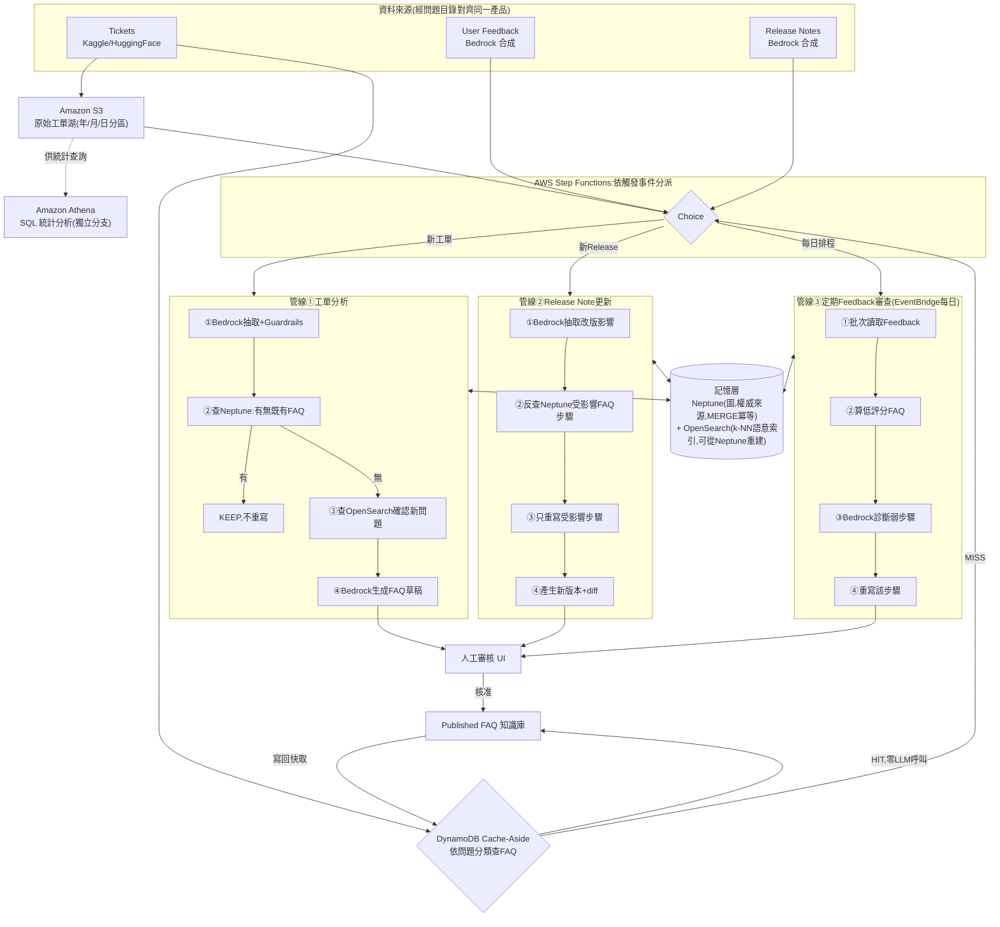
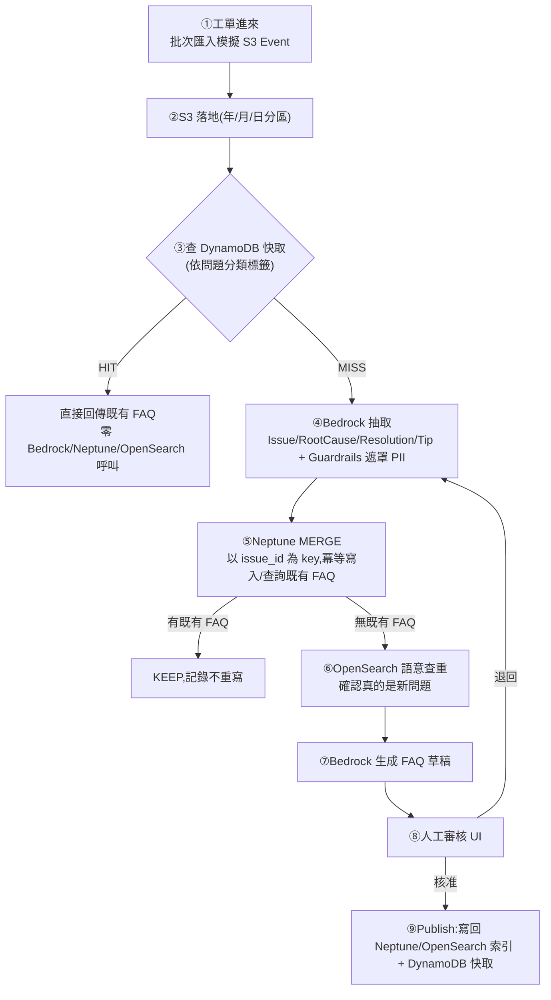

# Ticket-to-Knowledge — 設計文件

| 項目 | 內容 |
|---|---|
| 版本 | v1.0(Demo 設計基準) |
| 日期 | 2026-09-13 |
| 狀態 | Draft — 供 7 天工期實作與履歷/面試素材使用 |
| 目標平台 | AWS(CDK/Python IaC),個位數到 $20 美金預算,錄完 demo 即拆除 |
| 定位 | 觀察客服工單,持續彙整成 FAQ 知識庫的自我優化系統;單人 7 天 demo 專案 |

> 本文件是專案決策的**收斂敘事版**,取代討論過程中的探索紀錄。完整的逐步決策過程、方案比較與修正歷史保留在工作文件 `aws-architecture-decisions.md`;規模化到正式產品的延伸討論在 `from-demo-to-production.md`。三份文件分工:這份文件回答「最後長什麼樣子、為什麼」,另外兩份分別回答「怎麼決定出來的」跟「如果要撐更大會怎麼樣」。

---

## 目錄

1. [摘要](#1-摘要)
2. [問題與定位](#2-問題與定位)
3. [目標、非目標與範圍護欄](#3-目標非目標與範圍護欄)
4. [名詞定義](#4-名詞定義)
5. [系統架構(AWS)](#5-系統架構aws)
6. [資料流:一則事件的旅程](#6-資料流一則事件的旅程)
7. [資料來源策略](#7-資料來源策略)
8. [記憶層設計:Neptune 圖譜 + OpenSearch 索引 + S3](#8-記憶層設計neptune-圖譜--opensearch-索引--s3)
9. [三條 pipeline 規格](#9-三條-pipeline-規格)
10. [雙寫一致性與冪等設計](#10-雙寫一致性與冪等設計)
11. [比對策略:硬比對、語意比對、AI 判斷](#11-比對策略硬比對語意比對ai-判斷)
12. [為什麼是三條固定管線,不是 Bedrock Agent](#12-為什麼是三條固定管線不是-bedrock-agent)
13. [指標與分析](#13-指標與分析)
14. [Demo 腳本](#14-demo-腳本)
15. [安全、成本與關閉清單](#15-安全成本與關閉清單)
16. [風險與緩解](#16-風險與緩解)
17. [未來方向](#17-未來方向)
18. [附錄](#18-附錄)

---

## 1. 摘要

這個系統替客服團隊持續把重複出現的工單彙整成 FAQ,並且用真實的使用結果衡量這篇 FAQ 有沒有真的解決問題。它從三種訊號學習:

| 訊號 | 系統從中學到 | 對應動作 |
|---|---|---|
| Support Tickets | 使用者卡在什麼問題 | CREATE(建立新 FAQ)/ KEEP(已有 FAQ,不重寫) |
| Release Notes(產品改版) | 哪些 FAQ 的解法過期了 | UPDATE(只改受影響的那一步) |
| User Feedback(評分、留言) | 哪些 FAQ 沒有真的解決問題 | REFINE(重寫弱步驟) |

三個核心設計重點:

1. **精準溯源、精準改寫**:產品改版時沿著圖譜的邊,只找出、只重寫真正受影響的那個解法,其他 FAQ 完全不被觸碰。
2. **雙資料庫各司其職,不是重複建模**:Neptune 回答「這個問題的根因、解法、關聯是什麼」(關聯查詢),OpenSearch 回答「這個新問題跟既有的像不像」(語意查詢),兩者互為權威來源與衍生索引,不是兩份彼此競爭的真相。
3. **流程固定、判斷開放**:三條 Step Functions 管線的路徑寫死、可預測、可重跑,只有需要讀懂文字的節點才呼叫 Bedrock——刻意不採用 Bedrock Agent 自主決策,因為這個系統每張工單的決策順序都相同,Agent 的臨場彈性換不回實際好處。

整套系統跑在 AWS 上:S3、DynamoDB、Step Functions、Lambda、Bedrock 都有 always-free 或一次性免費額度;Neptune、OpenSearch 屬於「用完即刪」的常駐資源,已評估過 DynamoDB 全替代方案但最終定案保留這兩個服務(理由見第 8、10 章)。全部花費預估在個位數到 $20 美金以內,錄完 demo 影片即整組拆除。

---

## 2. 問題與定位

### 2.1 問題

客服團隊每天處理大量重複性工單,但把這些工單彙整成給使用者自助查閱的 FAQ 是件苦差事:沒有人力持續盯著「這個問題是不是已經有人問過」「產品改版後,哪些舊 FAQ 已經教錯了」「使用者看完 FAQ 之後,問題到底有沒有真的解決」。結果是 FAQ 庫要嘛長期不更新、要嘛充滿重複內容、要嘛沒人知道哪些其實沒用。

### 2.2 定位:三個問題

系統只回答三件事:

1. **該寫什麼 FAQ?** 工單告訴你——重複出現的問題就該有一篇 FAQ。
2. **FAQ 還正確嗎?** 產品改版告訴你——解法引用的功能變了,FAQ 就該跟著改。
3. **FAQ 有效嗎?** 使用者評分與留言告訴你——沒有解決問題的 FAQ 該被重寫。

### 2.3 範圍

這是一個 7 天完成、錄一次 demo 影片就拆除的作品集專案,不是要處理真實客服系統的即時流量。資料是 Kaggle/HuggingFace 的公開工單資料集(靜態、一次性),搭配 Bedrock 合成的 release note 與 user feedback,三者透過共用的「問題目錄」對應到同一個假想產品,好讓三條 pipeline 的故事能被完整展示(詳見第 7 章)。

---

## 3. 目標、非目標與範圍護欄

### 3.1 目標

- **G1**:從一批工單自動辨識重複問題、去重,建立第一版 FAQ。
- **G2**:新工單進來時能正確判斷「這是已知問題」還是「這是新問題」,避免重複生成。
- **G3**:一則 release note 進來,只重寫真正受影響的 FAQ 解法步驟,其餘 FAQ 不受影響,並產生 diff。
- **G4**:累積的 feedback 能觸發對弱 FAQ 的重寫(定期審查,不因單一低分立即改動)。
- **G5**:高頻重複問題能透過快取層跳過整套推理流程,呼叫 Bedrock 的次數隨系統運作而下降。
- **G6**:全程可在低成本(個位數到 $20 美金)內完成,demo 後可完整拆除,不留殘餘計費。

### 3.2 非目標

不做:真正的客服系統整合(不接 Zendesk/ServiceNow 等真實工單來源)、多語系、企業級 SSO/權限系統、複雜的審核 dashboard、模型微調、多 agent 協作、即時串流攝取(demo 用批次/模擬觸發代替)、瀏覽器合成使用者測試。這些留在第 17 章當作規模化時的路線圖。

### 3.3 只做兩條 loop

```
Loop 1  Ticket → FAQ → Feedback → Refine → 下一次 FAQ 品質更好
Loop 2  Release Note → 受影響的 Resolution → 只改那一步 → diff
```

兩條 loop 穩定可 demo,核心故事就成立。

---

## 4. 名詞定義

| 名詞 | 定義 | 對應 AWS 落地 |
|---|---|---|
| Ticket | 原始客服工單(來自 Kaggle/HuggingFace 資料集) | S3 原始檔案(年/月/日分區) |
| Issue | 正規化後的問題類型節點,MERGE 去重後的穩定身分 | Neptune 節點 |
| RootCause | 問題的根本原因(可能跟特定產品版本綁定) | Neptune 節點 |
| Resolution | 根因對應的解法 | Neptune 節點 |
| Tip | 附加在解法上的補充建議 | Neptune 節點 |
| FAQ | 發布給使用者看的知識庫文章,整合 Issue/RootCause/Resolution/Tip 內容 | Neptune 節點 + OpenSearch 索引 + DynamoDB 快取項目 |
| ReleaseNote | 正規化後的產品改版事件 | Neptune 節點(透過 `INVALIDATES` 邊指向受影響的 RootCause) |
| Feedback | 使用者對某篇 FAQ 的評分與留言 | 批次讀取,不即時進圖譜 |
| 五種動作 | CREATE / KEEP / UPDATE / REFINE / RETIRE | 由三條管線各自產生 |

### 4.1 圖譜的邊(關係)

```
(Ticket) -[:REPORTS]-> (Issue) -[:CAUSED_BY]-> (RootCause) -[:RESOLVED_BY]-> (Resolution) -[:DOCUMENTED_IN]-> (FAQ)
                                                (Resolution) -[:ALSO_RECOMMENDS]-> (Tip)
                                              (ReleaseNote) -[:INVALIDATES]-> (RootCause)
```

沿用整個決策過程中一直使用的例子:「登入失敗-驗證碼錯誤」是一個 Issue,根因是「app v2.3 驗證碼邏輯錯誤」這個 RootCause,解法是「升級至 v3.1 或套用 hotfix」這個 Resolution;產品真的發布 v3.1 後,對應的 ReleaseNote 會 `INVALIDATES` 這個 RootCause,觸發第 9 章的管線②去精準改寫這篇 FAQ 的解法步驟,而不影響其他跟這次改版無關的 FAQ。

### 4.2 兩種「記憶」各管一件事,不要混用

| 記憶 | 內容 | 存在哪 |
|---|---|---|
| 圖譜(Neptune) | 事實與關係本身——誰是誰的根因、誰解決了誰、哪些 FAQ 引用了哪個 RootCause | Neptune,權威來源 |
| 語意索引(OpenSearch) | 從圖譜衍生出來、可重建的相似度索引,只回答「這個新問題像不像既有的」 | OpenSearch,衍生索引 |
| 快取(DynamoDB) | 已核准 FAQ 的成品,依問題分類查詢用來跳過整套流程 | DynamoDB,cache-aside |

三者不是三份互相競爭的真相,而是三種不同用途的投影——完整理由見第 8、10 章。

---

## 5. 系統架構(AWS)

### 5.1 元件對照

| 階段 | 原黑客松工具 | AWS 服務 | 費用 |
|---|---|---|---|
| 記憶建構 | Cognee.ai | Bedrock(Claude 抽取 + Guardrails PII 遮罩 + Titan Embeddings) | 按 token 計費,demo 規模幾美元 |
| 記憶儲存 | HydraDB | Amazon Neptune(圖) | 750 小時免費試用(綁「沒用過 Neptune」) |
| 即時查詢 | hotdata.dev | Amazon Athena(SQL 統計)+ Amazon OpenSearch Service(語意查重) | Athena 用多少付多少;OpenSearch 舊帳號 12 個月免費、新帳號未確認 |
| 執行/協調 | RocketRide.ai | AWS Step Functions(三條固定管線)+ Lambda + Bedrock | Step Functions/Lambda always-free 額度內 |
| 肌肉記憶/可靠性 | Modiqo.ai(Rote) | Amazon DynamoDB(cache-aside 快取) | always-free 額度內 |
| 安全掃描 | Snyk | Snyk(CI/CD)+ Amazon Inspector / CodeGuru Security | Snyk 免費方案 |

### 5.2 架構圖



*圖 5-1:三個訊號進來後,新工單先過 DynamoDB 快取(HIT 直接出、零 LLM 呼叫);MISS 或另外兩種訊號進入 Step Functions 的 Choice,依事件類型分派到三條固定管線;三條管線各自在固定節點呼叫 Bedrock,並共用 Neptune+OpenSearch 這個記憶層;草稿匯流到人工審核,核准後發布並寫回快取。*

### 5.3 設計原則

**流程固定、判斷開放**:三條 pipeline 的路徑在 Step Functions 裡寫死,可預測、可重跑、出錯知道停在哪;只有需要讀懂文字、下判斷的節點才呼叫 Bedrock。這個原則直接決定了第 12 章「為什麼不用 Bedrock Agent 自主決策」的答案。

---

## 6. 資料流:一則事件的旅程

以「新工單」這條最完整的路徑為例(release note 與 feedback 的旅程是它的子集,差別在觸發點與管線內容,詳見第 9 章):



*圖 6-1:單一工單從進入系統到成為一篇被快取的 FAQ,完整經過的九個步驟。*

| 段 | 做什麼 | 呼叫 Bedrock? |
|---|---|---|
| ① | 工單抵達(demo 用批次匯入模擬即時觸發) | 否 |
| ② | 存進 S3,供 Athena 之後做統計分析用 | 否 |
| ③ | 查 DynamoDB,依問題分類標籤查有無已核准 FAQ | 否 |
| ④ | 抽取結構化資料(Issue/RootCause/Resolution/Tip)+ PII 遮罩 | 是 |
| ⑤ | Neptune MERGE 寫入/查詢,判斷是否已有對應 FAQ | 否(純資料庫操作) |
| ⑥ | OpenSearch k-NN 查重,避免字面不同但語意相同的問題被誤判成新問題 | 否(向量搜尋,embedding 呼叫在④已做) |
| ⑦ | 產出 FAQ 草稿(Title / Problem / Resolution / Tip) | 是 |
| ⑧ | 人工審核,核准或退回修改 | 否 |
| ⑨ | 核准後寫回三處:Neptune(權威來源已有)、OpenSearch(索引)、DynamoDB(快取,供下次直接命中) | 否 |

九步裡只有④⑦兩步真的呼叫 Bedrock,其餘都是確定性的資料庫操作或人工判斷——這正是「流程固定、判斷開放」在單一事件層級的體現。

---

## 7. 資料來源策略

### 7.1 三種訊號從哪裡來

| 訊號 | 來源 | 性質 |
|---|---|---|
| Tickets | Kaggle / HuggingFace 上的 Multilingual Customer Support Tickets 資料集 | 真實公開資料,靜態、一次性下載 |
| Release Notes | Bedrock 合成 | 人工設計腳本,確保至少有一則會精準命中 demo 腳本裡展示的 RootCause |
| User Feedback | Bedrock 合成 | 針對已生成的 FAQ 產生評分與留言,確保有低分樣本可觸發管線③ |

三者透過共用的「問題目錄」(同一組 Issue/RootCause/Resolution 名稱)彼此對應,讓合成的 release note 與 feedback 能精準命中工單資料集裡真實存在的問題,而不是各自獨立、對不起來的假資料。

### 7.2 為什麼不做「接入層學習」(Rote for ingestion)

參考組員設計文件後,刻意評估過是否要仿照他們的做法,讓 Agent 在第一次遇到新來源的 webhook payload 時自主摸索、之後記憶重放。**結論是不採用**:這個系統的資料來源是單一、靜態的資料集,從頭到尾只有一種已知的 payload 形狀,不存在「未知來源格式」這個問題——Rote 層要解決的問題(每個 indie 專案接的來源都不同、需要一次性學會怎麼解析)在這個專案裡不成立。

這不代表這個概念沒有價值:如果未來要接真實的客服系統(Zendesk、Salesforce 等),不同來源、不同時期改版的 webhook 格式確實會需要類似的「先學一次、之後零成本重放」機制,這點記錄在第 17 章的未來方向。

### 7.3 為什麼三種訊號不是各自獨立的三條資料管道

如果 tickets、release notes、feedback 各自隨機生成、彼此對不上,demo 就沒辦法展示「release note 精準改寫」跟「feedback 觸發弱點重寫」這兩條 loop,因為系統找不到對應關係。用共用問題目錄把三者綁在一起,才能讓 demo 腳本(第 14 章)裡「先建立 FAQ → 改版讓它過期 → 重寫」這個完整故事線是真的跑得通的,而不是三段互不相關的展示。

---

## 8. 記憶層設計:Neptune 圖譜 + OpenSearch 索引 + S3

### 8.1 為什麼是 Neptune + OpenSearch,而不是 DynamoDB

參考組員設計文件後,曾經認真評估把 Neptune 換成 DynamoDB 單表(adjacency list)、把 OpenSearch 換成 DynamoDB + Lambda 暴力法 cosine similarity——這兩個替代方案在功能上對這個專案已知的查詢型態確實等價,完整的方案 A/B 比較表保留在 `aws-architecture-decisions.md`。最終定案原因:

| | Neptune + OpenSearch(採用) | DynamoDB 全替代 |
|---|---|---|
| 7 天demo 花費 | 樂觀 $0~2,悲觀(新帳號 OpenSearch 免費層不確定)約 $6~10 | 幾乎 $0 |
| 架設/學習時間 | 多花半天~一天學 Cypher 語法與 OpenSearch index mapping(VPC 複雜度已用 Public Endpoint+IAM 排除) | 省去該學習曲線,但要手寫多跳查詢與暴力比對邏輯,時間轉移而非省下 |
| 履歷故事 | 圖形資料庫 + 向量搜尋,兩個獨立、專門化的技能點,搭配完整的替代方案權衡論述 | DynamoDB 單表打天下,作品集裡常見樣式,較無記憶點 |

金錢與時間差距都在可接受範圍內,決定性因素是履歷故事的差異化——這套判斷過程本身(評估過替代方案、能說清楚為什麼選這個)也是要展示的能力之一。

### 8.2 Neptune:圖譜 schema

沿用第 4.1 節的邊定義,實際寫入範例:

```cypher
MERGE (t:Ticket {ticket_id: 'T-10234'})
MERGE (i:Issue {issue_id: 'ISSUE-a1b2c3', name: '登入失敗-驗證碼錯誤'})
MERGE (rc:RootCause {name: 'app-v2.3-驗證碼邏輯錯誤'})
MERGE (r:Resolution {name: '升級至 v3.1 或套用 hotfix'})
MERGE (t)-[:REPORTS]->(i)
MERGE (i)-[:CAUSED_BY]->(rc)
MERGE (rc)-[:RESOLVED_BY]->(r)
```

查詢範例(管線②反查受影響 FAQ):

```cypher
MATCH (rn:ReleaseNote {release_id: 'REL-042'})-[:INVALIDATES]->(rc:RootCause)
MATCH (rc)<-[:CAUSED_BY]-(:Issue)-[:CAUSED_BY|RESOLVED_BY*1..2]-(r:Resolution)-[:DOCUMENTED_IN]->(f:FAQ)
RETURN DISTINCT f.faq_id, r.name
```

`issue_id` 是 MERGE 的 key,必須是穩定值——**不能直接用 LLM 生成的自然語言文字**,因為 LLM 輸出不保證跨次呼叫一致。做法是把 Bedrock 抽取結果先快取(依 ticket_id 或工單原文雜湊值),整段重試時直接沿用快取結果,而不是重新呼叫 LLM(完整推導見第 10 章)。

連線方式採 **Public Endpoint + IAM 驗證**,不採 VPC-only——Lambda 不用進 VPC,免去 NAT Gateway/VPC Interface Endpoint 的設定與費用,代價是安全防線從網路隔離轉為身份驗證(SigV4 簽章),對 7 天 demo 這個信任模型是合理取捨。

### 8.3 OpenSearch:索引設計

```json
PUT /faq-index
{
  "mappings": {
    "properties": {
      "issue_id":       { "type": "keyword" },
      "issue_category":  { "type": "keyword" },
      "product_area":    { "type": "keyword" },
      "created_at":      { "type": "date" },
      "text":            { "type": "text" },
      "embedding": {
        "type": "knn_vector",
        "dimension": 512,
        "method": {
          "engine": "faiss",
          "name": "hnsw",
          "space_type": "cosinesimil",
          "parameters": { "ef_construction": 128, "m": 16 }
        }
      }
    }
  }
}
```

embedding 模型用 **Titan Text Embeddings V2**,輸出維度選 512(可配置 1024/512/256,demo 規模選較小維度即可,省儲存也省運算);文件 `_id` 明確指定為 `issue_id`(不用自動產生的隨機 ID),讓重複索引變成覆寫而非新增,這是雙寫冪等設計的關鍵一環(第 10 章)。

範例文件:

```json
PUT /faq-index/_doc/ISSUE-a1b2c3
{
  "issue_id": "ISSUE-a1b2c3",
  "text": "登入失敗-驗證碼錯誤",
  "embedding": [0.0123, -0.0451, 0.0892, "... 512 維"],
  "issue_category": "登入",
  "product_area": "auth",
  "created_at": "2026-08-14T10:22:00Z"
}
```

### 8.4 S3:原始工單湖

```
tickets/year=2026/month=08/day=14/*.json       # 只增不改,時間分區
```

Athena 透過 **Partition Projection** 自動推算分區,不需要額外的 Glue Crawler 或手動 MSCK REPAIR;新工單抵達走 S3 Event Notification 觸發 Lambda,跟 Partition Projection 是兩條互相獨立、剛好對應同一個 S3 寫入事件的機制(一個管 Athena 查詢時怎麼找檔案,一個管新資料寫入時怎麼觸發處理),詳細推導見 `aws-architecture-decisions.md` 第三層。

### 8.5 DynamoDB:cache-aside 快取(第五層)

```json
{
  "PK": "CATEGORY#登入",
  "faq_id": "FAQ-1092",
  "faq_version": 2,
  "content": { "title": "...", "steps": ["..."] },
  "approved_at": "2026-08-20T09:00:00Z"
}
```

以問題分類標籤當 key,查詢是毫秒等級的 key-value 查詢;新工單進來先查這裡,命中就直接回傳、完全不觸碰 Bedrock/Neptune/OpenSearch,是整個系統「越用越省」的機制。這一層從一開始就定案採用,跟第 8.1 節「Neptune/OpenSearch vs. DynamoDB」的評估是完全獨立的兩件事——不要混為一談(這件事在討論過程中確實造成過一次誤解,記錄在 `aws-architecture-decisions.md`)。

---

## 9. 三條 pipeline 規格

三條 pipeline 共用同一個 Neptune 圖譜、同一個 OpenSearch 索引、同一個 DynamoDB 快取,差別只在**觸發、範圍、動作**。實作上是同一個 Step Functions state machine,開頭一個 Choice 節點依事件型別分三路。

### 9.1 管線①:工單分析(觸發:新工單,經第五層快取 MISS 之後)

| 節點 | 類型 | 做什麼 |
|---|---|---|
| extract | Bedrock(Claude)+ Guardrails | 抽取 Issue/RootCause/Resolution/Tip,PII 遮罩 |
| merge_graph | Lambda → Neptune | MERGE 節點與邊,以 issue_id 為冪等 key |
| find_existing | Neptune 查詢 | 這個 Issue 是否已有對應 FAQ |
| branch | Choice | 有 → KEEP,記錄不重寫,結束;沒有 → 繼續 |
| dedupe_check | Lambda → OpenSearch | 語意查重,確認真的是新問題而非措辭不同的舊問題 |
| write_faq | Bedrock(Claude) | 產出 FAQ 草稿(Title / Problem / Resolution / Tip) |
| create_version + review | Lambda + 人工審核 UI | 送審,核准後 publish |
| publish | Lambda | 寫回 Neptune(FAQ 節點)、OpenSearch(索引)、DynamoDB(快取) |

### 9.2 管線②:Release Note 更新(觸發:新 release note)

| 節點 | 類型 | 做什麼 |
|---|---|---|
| extract_change | Bedrock(Claude) | 從 release note 抽取 `{feature/root_cause, kind, old, new}` |
| find_affected | Neptune 查詢(`INVALIDATES` 反查) | 沿邊找出哪些 FAQ 引用了受影響的 RootCause |
| rewrite_step | Bedrock(Claude) | 只重寫受影響的 Resolution/Tip 內容,其餘 FAQ 段落原文複製 |
| create_version + diff | Lambda | 產生下一版 FAQ + diff,記錄原因(`release:<id>`) |
| review + publish | 人工審核 UI + Lambda | 核准後發布 |

### 9.3 管線③:定期 Feedback 審查(觸發:EventBridge 每日排程)

| 節點 | 類型 | 做什麼 |
|---|---|---|
| aggregate | Lambda | 批次讀取累積的 feedback,算出平均評分低於門檻且樣本數足夠的 FAQ |
| diagnose | Bedrock(Claude) | 從留言判斷是哪一步、為什麼沒解決問題 |
| rewrite_step | Bedrock(Claude) | 重寫該步驟 |
| create_version + review + publish | Lambda + 人工審核 UI | 同上 |

刻意用**每日批次**而非即時觸發,呼應「不能因為一個人給低分就立刻改」的原則——延伸自組員設計文件的同一個考量,demo 裡用手動觸發排程來模擬。

---

## 10. 雙寫一致性與冪等設計

Neptune 跟 OpenSearch 是兩個獨立的資料庫,沒有共用的交易邊界——管線①寫入 Neptune 成功、寫入 OpenSearch 失敗(或反過來)是真實會發生的風險。這一章記錄怎麼在不做跨資料庫交易的前提下,把這個風險降到可接受。

### 10.1 具體風險

若 Neptune 寫成功、OpenSearch 失敗:這個 Issue 已經存在圖裡,但語意搜尋找不到它,下次語意相近的新工單進來會被誤判成「全新問題」,讓 Bedrock 重複生成 FAQ——恰好是這套系統想避免的事。反過來則會在 OpenSearch 留下指向不存在節點的懸空向量。

### 10.2 解法:冪等性 + 整段重試,而非跨資料庫交易

兩個資料庫本來就不支援分散式交易,硬做反而複雜脆弱。解法核心是讓兩邊各自冪等:

- **Neptune**:用 `MERGE`(以 `issue_id` 為 key),同一個 key 跑幾次都只對應同一個節點。
- **OpenSearch**:索引時明確指定 `_id` 為同一個 `issue_id`(而非自動生成的隨機 ID),重複索引變成覆寫而非新增。

兩邊都冪等之後,失敗處理不需要區分「哪一步失敗」,直接讓**整段 Lambda 重跑**(連 Bedrock 抽取都重打一次)即可——重跑到已成功的步驟,冪等性保證無害;卡住失敗的那步,這次換成功。代價是重跑會多花一點 Bedrock 費用,換來完全不用維護 checkpoint 狀態追蹤的簡單性。

```
① Bedrock 抽取 → ② Neptune MERGE(冪等)→ ③ OpenSearch 索引(同 issue_id 為 _id,冪等)
                                            │
                                失敗 ────────┘──▶ 整段重試(①②③ 都重做,安全)
```

### 10.3 永久性失敗的兜底

若③持續失敗(非暫時性錯誤,重試也沒用),寫進一張小的「待補索引佇列」(DynamoDB,記錄 `{issue_id, status: "neptune_only"}`),搭配定期執行的「一致性校驗」Lambda,比對 Neptune 節點清單與 OpenSearch 已索引的 `_id` 清單,補寫缺漏的差異。這是最終一致性(eventual consistency)+ 自我修復設計,不強求每次即時完美同步,但保證系統會自己抓出並修正落差。

### 10.4 決策修正:MERGE key 不能直接用 LLM 生成的文字

MERGE 的運作方式是「照屬性值查有沒有既有節點,找到就沿用、找不到才新建」——這代表**同一個 key 值**不管跑幾次都只對應同一個節點,是冪等性的來源。但如果 MERGE key 是 LLM 生成的自然語言(例如 `name: '登入失敗-驗證碼錯誤'`),風險在於:整段重跑時連 Bedrock 都重打一次,LLM 不保證每次輸出一模一樣的文字(這次吐「登入失敗-驗證碼錯誤」,下次可能吐「登入時驗證碼錯誤」)——MERGE 拿去比對的字串不同,會誤判成全新問題,反而建出重複節點,冪等性保證就破功了。

**修正做法**:①呼叫 Bedrock 那步也做成可重用上次結果——把 Bedrock 的抽取結果先快取(以 ticket_id 或工單原文雜湊值為 key),重跑時先查快取、沿用既有結果去做②③,不重新呼叫 Bedrock。這樣②③用的 key 值每次重跑保證相同,冪等性才真正成立。這個快取機制可以跟第五層的 DynamoDB cache-aside 共用基礎設施,只是快取對象不同——第五層快取「核准後的 FAQ 成品」,這裡快取「Bedrock 單次抽取的原始結果」。

### 10.5 為什麼 Neptune/OpenSearch 內容重複不是設計缺陷

同一段問題文字同時存在 Neptune 節點屬性跟 OpenSearch 的 `text`/`embedding` 欄位裡,這是刻意且標準的做法,叫 **polyglot persistence**,類似 CQRS 的精神。兩邊做的是完全不同、彼此替代不了的工作:Neptune 回答「什麼跟什麼有關係」(多跳關聯查詢);OpenSearch 回答「語意上像不像既有問題」(近似最近鄰向量搜尋)。Neptune 是權威來源,OpenSearch 是可以從 Neptune 完整重建的衍生索引——真的毀損了,重新對 Neptune 的問題節點文字跑一次 embedding、重新索引就能復原,不會遺失任何事實。

---

## 11. 比對策略:硬比對、語意比對、AI 判斷

原則:**什麼決定結果,就比對什麼**;語意判斷做一次,存成穩定的 ID 或標籤,之後所有比對都用這個 ID,不要每次都重新問 AI。

| 比對點 | 決定結果的是 | 硬比對(零成本) | 語意比對(便宜) | AI 判斷(第三層才用) |
|---|---|---|---|---|
| 管線①:這是不是已知問題 | Issue 身分 | Neptune 依 issue_id 查既有節點 | OpenSearch k-NN 語意查重 | 命名新的 Issue、確認邊界(僅未命中時) |
| 管線②:哪些 FAQ 受影響 | RootCause 編號 | Neptune 沿 `INVALIDATES`/`CAUSED_BY` 邊反查 | — | 從 release note 文字抽取出是哪個 RootCause |
| 管線③:哪些 FAQ 要 REFINE | 評分與樣本數 | Lambda 純數字運算(平均分、門檻) | — | 診斷是哪一步、為什麼沒解決問題 |

為什麼不每次都讓 AI 判斷:硬比對只能比 ID 與結構,不能比意思;語意比對能抓出「用詞不同但意思相同」,但成本比硬比對高;AI 判斷最貴、也最不可預測,只在前兩層都無法決定時才使用。三層各自只在前一層無法給出答案時才往下一層走,前兩層對大多數請求而言零成本。

---

## 12. 為什麼是三條固定管線,不是 Bedrock Agent

**決策紀錄**:最初設計是 Bedrock Agent 自主決策(Agent 自己決定要不要查 Neptune、要不要查 OpenSearch、下一步做什麼),參考組員設計文件後改採三條固定管線。兩案都保留在 `aws-architecture-decisions.md`(含骨架圖與 ASCII 圖),這裡整理精簡版的決策論述。

### 12.1 核心判斷準則

「可預測」不等於「天生比較好」——Agent 自主決策的價值,建立在「任務的決策結構真的每次都不一樣、事先無法窮舉」這個前提上。這個系統實際確認過:每一張工單的決策順序都相同(查 Neptune 有無既有 FAQ → 查 OpenSearch 確認相似度 → 決定要不要生成),沒有哪張工單需要不同的查詢順序或次數。Agent 的臨場判斷自由度在這裡用不到,而付出的代價(結果不可重放、除錯困難、成本難預估)是真實的。

| | 固定管線(採用) | Bedrock Agent 自主決策 |
|---|---|---|
| 可重放/可稽核 | 高——每次執行路徑相同,出錯知道停在哪 | 低——同樣輸入不保證同樣的工具呼叫順序 |
| 成本/延遲可預估性 | 高 | 低——呼叫次數隨 Agent 自主決定而變動 |
| 應付未知形狀的輸入 | 弱——路徑寫死,遇到真正需要臨場判斷的情境無法應變 | 強 |
| 適合的任務性質 | 決策結構已知、固定,尤其是「寫」類任務(錯誤會複合累積) | 決策結構真的多變、無法事先枚舉 |

若之後任務變成「每張工單需要的查詢深度差異很大、事先無法枚舉」,Bedrock Agent 才會是對的選擇——這不是固定管線天生更好,而是**這個專案的任務性質剛好落在固定管線適用的那一側**。這個論點也呼應 Cognition AI 在其部落格文章中對「寫」類任務不適合多 agent 協作的論述。

### 12.2 跟第五層快取的關係

第五層(DynamoDB cache-aside)的判斷邏輯,概念上就是管線①的第②步(查有無既有 FAQ)——只是快取層在事件抵達 Choice 節點之前就先攔截,兩者是同一個「先查有沒有,再決定要不要做」的概念,只是介入的時間點不同。

---

## 13. 指標與分析

> 以下數字是**示範用的假設值**,用來說明指標怎麼定義、demo 腳本想展示什麼樣的變化;實際數字以真正錄製 demo 時的執行結果為準,錄製後應該用真實數字取代這裡的表格。

| 指標 | 定義 | 對應什麼問題 |
|---|---|---|
| 快取命中率 | 新工單查 DynamoDB 直接命中既有 FAQ 的比例 | 系統有沒有「越用越省」 |
| 去重準確率 | OpenSearch 語意查重正確判斷「已知問題」的比例(相對人工標註) | 避免重複生成 FAQ |
| 每次執行 Bedrock 呼叫數 | 一次 Step Functions 執行內,實際呼叫 Bedrock 的節點數 | 冷啟動 vs. 系統暖機後的成本差異 |
| 人工審核核准率 | 草稿一次通過人工審核、不需要退回修改的比例 | Bedrock 生成品質 |
| 精準改寫比例 | 一次 release note 事件,受影響 FAQ 數 ÷ FAQ 總數 | 證明「只改受影響的」而非全庫重寫 |
| 平均評分 | 每篇 FAQ 版本的使用者評分平均 | FAQ 有沒有解決問題(Kirkpatrick Level 1 類比) |

### 13.1 Demo 示範數字(illustrative)

| 指標 | 系統暖機前(冷啟動) | 系統暖機後 |
|---|---|---|
| 快取命中率 | 0% | 約 60~70% |
| 每次執行 Bedrock 呼叫數 | 2~3 次(抽取 + 生成) | 0 次(快取命中時) |
| 平均評分 | 2.8 | 4.3 |
| 負面 feedback 數(同批次) | 8 | 2 |
| 精準改寫比例(一次 release note) | — | 例如 30 篇 FAQ 中僅 1 篇受影響並被改寫 |

---

## 14. Demo 腳本

> 時間軸與數字同樣是示範用的規劃值,實際執行時依真實結果調整。

```
T0  匯入 30 則種子工單           --管線①-->   建立首批 Issue/RootCause/Resolution 節點 + FAQ 草稿,人審核准,寫入快取
T1  送入 5 則語意相近但措辭不同的新工單 --查快取 MISS,查 Neptune 有既有 FAQ--> KEEP,不重複生成
                                 (另外示範:再送 1 則命中快取的重複問題 --> 零 Bedrock 呼叫,直接回傳)
T2  模擬 release note(驗證碼邏輯 v2.3→v3.1) --管線②--> 只反查、只重寫該 RootCause 對應的 FAQ 解法步驟,
                                                        產生 diff;其餘 FAQ 完全不受觸碰
T3  累積 10 則低評分 feedback     --管線③(手動觸發每日排程)--> Bedrock 診斷弱步驟,重寫,產生下一版
T4  現場示範冪等重試安全性:故意讓 Lambda 在寫入 OpenSearch 那步失敗、觸發整段重試,
                          證明 Neptune 節點與 OpenSearch 文件最終保持一致、不產生重複
T5  指標總結:快取命中率 0%→65% | Bedrock 呼叫數 3→0(命中時) | 平均評分 2.8→4.3
```

三個刻意演出的細節:

1. **T1 的快取命中對比**:同一批語意相近的問題,一則走「查 Neptune 判斷 KEEP」的路徑,一則走「查 DynamoDB 直接命中」的路徑,對照展示兩層防止重複的機制如何分工。
2. **T2 的精準改寫**:明確展示只有一篇 FAQ 被改動、其餘完全不受影響,證明圖譜反查的精準度。
3. **T4 的冪等示範**:刻意注入失敗、展示整段重試後資料一致,這是最能證明系統工程深度的橋段,建議務必納入 demo 影片。

執行策略:每一拍的輸出先跑好快取,現場展示 diff 與審核卡片;真正 live 跑一段(建議是 T4 冪等重試)就夠,避免 LLM 延遲拖累影片節奏。

---

## 15. 安全、成本與關閉清單

### 15.1 成本估算

個位數到 $20 美金以內。Neptune(db.t3.medium/t4g.medium)有 750 小時免費試用,綁「沒用過 Neptune」而非帳號新舊,這次大機率吃得到全免費;OpenSearch(t3.small.search)在 2025-07-15 前的舊帳號 12 個月免費層內確定免費,新帳號是否算進新版 $200 額度無官方明確保證,動工前務必自行到 AWS Billing → Free Tier 頁面確認。Lambda、Step Functions、DynamoDB、S3 都在 always-free 額度內。Bedrock 按 token 計費,demo 規模幾百次呼叫是幾美元等級。

### 15.2 費用陷阱

- Neptune 連線採 **Public Endpoint + IAM 驗證**,不採 VPC-only,省去 NAT Gateway($0.045/小時+$0.045/GB,無免費額度)這筆一週約 $7~8 美金的費用。
- 不要誤用 Bedrock Knowledge Bases 預設的 OpenSearch Serverless(每小時最低容量費),這裡是自己建索引,不用它。
- Athena 用 Partition Projection 避免額外的 Glue Crawler 費用。

### 15.3 安全

- Snyk(CI/CD)掃依賴套件;Amazon Inspector 掃 Lambda 函式跟容器映像檔;Amazon CodeGuru Security 對 Python 程式碼做靜態分析,抓 SQL injection 風險、硬編碼密鑰等問題。
- Bedrock 呼叫設 max_tokens 與逾時;Step Functions 每個 Task 設 Retry 與 Catch。

### 15.4 關閉清單

1. 建立時就設 $1 的 Budgets 警示。
2. Neptune、OpenSearch 是「用完即刪」資源——錄完 demo 影片當場刪除,不要等到月底。
3. S3、DynamoDB、Lambda、Step Functions 留著也不太會計費,但專案結束後一併清除,保持帳號乾淨。

---

## 16. 風險與緩解

| 風險 | 影響 | 緩解 |
|---|---|---|
| Neptune/OpenSearch 雙寫不一致 | 語意搜尋找不到已存在的問題,重複生成 FAQ | 冪等 MERGE/`_id` + 整段重試 + 定期一致性校驗(第 10 章) |
| MERGE key 若誤用 LLM 生成文字 | 重跑時可能建出重複節點,冪等性失效 | Bedrock 抽取結果先快取,重跑沿用快取而非重新呼叫 LLM |
| OpenSearch 新帳號免費層不確定 | 產生非預期費用 | 動工前查證 AWS Billing 頁面;必要時暫用 DynamoDB 備案(已完整設計,見 `aws-architecture-decisions.md`) |
| 圖譜邊建得不完整(漏抽 RootCause) | Release Note 反查漏掉受影響的 FAQ,產生假 KEEP | 對反查為零的情況,加一道語意搜尋交叉確認(safety net) |
| LLM 非決定性 | 同輸入不同輸出,影響冪等假設 | 判斷節點集中在少數固定節點;輸出用結構化 JSON 格式驗證 |
| 7 天工期風險 | 排程延誤 | 已用 Public Endpoint+IAM 排除 VPC 設定複雜度;demo 用預跑快取的輸出,只 live 一段 |
| Demo 延遲 | 影片節奏被 LLM 呼叫拖慢 | 預先跑好各拍輸出,只挑一段(建議冪等重試)真正 live 展示 |

---

## 17. 未來方向

規模化到真正線上產品的完整討論(攝取層改用 Kinesis/Firehose、儲存格式換 Apache Iceberg、Bedrock 抽取改批次推論、Neptune 換 VPC-only+read replica、OpenSearch 多節點、Step Functions 換 Express Workflow 等)已經寫在獨立文件 `from-demo-to-production.md`,這裡不重複,只列這份 demo 設計文件本身還沒做、但未來值得考慮的方向:

1. **真實客服系統整合**:接 Zendesk/ServiceNow 等真實工單來源,屆時不同系統的 webhook payload 形狀不同,組員設計文件裡的「Rote 接入學習層」(先讓 Agent 摸索、之後記憶重放)會變成真正有價值的機制,而不是像目前這樣因為單一靜態資料源而用不上。
2. **跨專案的 Authoring Rule 概念**:組員設計文件裡「從 feedback 歸納出可轉移的寫作規則」的想法,目前明確不採用(這個專案是單一產品的 demo,規則庫累積不出效果),但若這套系統要服務多個客戶/多個產品,規則庫可以在不同專案間共享,值得重新評估。
3. **合成使用者測試**:用瀏覽器 agent 模擬使用者照著 FAQ 操作,卡住的地方本身就是 feedback,不需要等真人回報。

---

## 18. 附錄

### A. 正規化物件 schema

```json
// Issue(第一層抽取後的結構化結果)
{"issue_id": "ISSUE-a1b2c3", "name": "登入失敗-驗證碼錯誤",
 "root_cause": "app-v2.3-驗證碼邏輯錯誤", "resolution": "升級至 v3.1 或套用 hotfix",
 "tip": "清除瀏覽器快取後再試一次", "ticket_id": "T-10234"}

// ReleaseNote
{"release_id": "REL-042", "invalidates_root_cause": "app-v2.3-驗證碼邏輯錯誤",
 "new_root_cause": "app-v3.1-已修正", "evidence": "release note 原文摘要"}

// Feedback
{"feedback_id": "F-3301", "faq_id": "FAQ-1092", "rating": 2,
 "comment": "照著步驟做還是找不到按鈕", "ts": "2026-08-22T10:00:00Z"}
```

### B. Step Functions 骨架(管線②:Release Note Update)

```json
{
  "StartAt": "ExtractChange",
  "States": {
    "ExtractChange":  {"Type": "Task", "Resource": "arn:aws:lambda:...:extract_change", "Next": "FindAffected",
                       "Retry": [{"ErrorEquals": ["States.ALL"], "MaxAttempts": 2}]},
    "FindAffected":   {"Type": "Task", "Resource": "arn:aws:lambda:...:find_affected_faqs", "Next": "RewriteSteps"},
    "RewriteSteps":   {"Type": "Map", "ItemsPath": "$.affected_faqs", "MaxConcurrency": 3,
                       "Iterator": {"StartAt": "RewriteOne", "States": {
                         "RewriteOne": {"Type": "Task", "Resource": "arn:aws:lambda:...:rewrite_resolution", "End": true}}},
                       "Next": "CreateVersion"},
    "CreateVersion":  {"Type": "Task", "Resource": "arn:aws:lambda:...:create_version", "Next": "Review"},
    "Review":         {"Type": "Task", "Resource": "arn:aws:lambda:...:submit_for_review", "Next": "Publish"},
    "Publish":        {"Type": "Task", "Resource": "arn:aws:lambda:...:publish", "End": true}
  }
}
```

### C. 名詞對照表

| 討論時的暫用說法 | 專案名詞 | AWS 落地 |
|---|---|---|
| 問題節點 | Issue | Neptune 節點,MERGE key = issue_id |
| 根因 | RootCause | Neptune 節點,可能綁定產品版本 |
| 解法 | Resolution | Neptune 節點 |
| 反查受影響的 FAQ | `INVALIDATES`/`CAUSED_BY` 邊反查 | Neptune openCypher 多跳查詢 |
| 語意查重 | dedupe_check | OpenSearch k-NN 搜尋 |
| 快取命中 | cache-aside HIT | DynamoDB `CATEGORY#<label>` 查詢 |
| 三條管線 | 工單分析 / Release Note 更新 / 定期 Feedback 審查 | AWS Step Functions,Choice 節點分派 |

### D. 參考資料

- 完整決策過程與方案比較:`aws-architecture-decisions.md`
- 規模化到正式產品的延伸討論:`from-demo-to-production.md`
- Amazon Titan Text Embeddings V2:https://docs.aws.amazon.com/bedrock/latest/userguide/model-card-amazon-titan-text-embeddings-v2.html
- Cognition — Don't Build Multi-Agents:https://cognition.ai/blog/dont-build-multi-agents

---

*本文件由對話整理而成,作為專案 README / ARCHITECTURE.md 的正式素材。*
